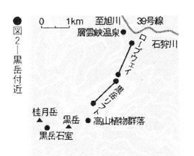

# 10. Freezing

| | |
| --- | --- |
| Pain | ▼▼▽▽▽ |
| Trouble | ▼▼▼▼▼ |
| Death state | ▼▼▼▽▽ |
| Implicated | ▼▽▽▽▽ |
| Impact | ▼▽▽▽▽ |
| Lethality | ▼▼▼▽▽ |

If you can find a good location, it's easy. However, be aware that it is possible that after a large-scale search, you will be rescued, but your hands and feet are frozen and must be amputated.

Freezing to death is probably as comfortable as hanging yourself. Hearing something like this, you may question its authenticity, but this is what the survivors said, so you have to believe it.

Even so, the number of people who use freezing as a means of suicide is definitely in the minority, and statistically they are also classified in the "other" category. Perhaps it is because it is too troublesome to go to the snowy mountains. But freezing to death is not a phenomenon that only occurs in snowy mountains and cold areas. As long as the conditions are right, people can freeze to death in rooms. Of course, the temperature does not have to be below freezing. Reports show that in fact, more than a dozen people freeze to death in Tokyo every year, and there are also cases in warmer places. Newspapers often report on homeless people freezing to death. For homeless people in Tokyo and Osaka, surviving the cold winter is a very practical wish.

All of this is just a lot of useless theory. After all, no one wants to freeze to death in a room, and I have never heard of someone committing suicide by freezing to death in a room. In the United States, some people commit suicide by freezing to death in a refrigerator. This can only be regarded as an exception. If you want to freeze to death, although it is troublesome, it is better to go to the snowy mountains. This method has many advantages. How can it make up for the trouble!? It will be introduced in detail below, such as no damage to the body and less pain.

A person's tolerance to cold is an important factor, so this method of suicide is not suitable for people who are too tolerant of the cold.

## Preparation

### Select a mountain leisure spot as your target!

If you want to go to the snowy mountains, first buy a guide book for a cold mountain retreat to understand the situation. Even without mountain climbing experience or physical strength, anyone can go to places that are cold enough to freeze to death. When you go skiing, go to places that are rarely visited. You might even be able to find a suitable place next to the ski practice area. Of course, those who enjoy mountaineering can decide the route and location very thoughtfully.

Things you need to bring: sedatives, painkillers and other drugs that can stabilize your mood and help you fall asleep, as well as alcohol available at pharmacies. Although drinking alcohol can raise your body temperature, drinking to overcome pain is also allowed. Anyway, it is difficult to resist the cold outside in the snow. If you take off your clothes, you can die in one night, but it is a bit difficult, so you should find a place where others can't find it for at least two or three days. If you can fall asleep, that would be even better.

### If you choose to freeze to death in the room, you have to choose the coldest time of winter

If you really want to die in your room, you have to choose a day in the middle of winter. You also have to look at the weather forecast and choose the coldest night. In addition, you must make some preparations to cool down your body: pour water on your whole body while being naked, then face the electric fan and air conditioner, and open the windows and refrigerator. It also requires fasting, lack of sleep and fatigue, otherwise it will be difficult to achieve. If you drink some wine beforehand, it will dilate the blood vessels on the surface of the body, quickly lower the body temperature, and has the effect of hastening death. Of course, some patience is also required, which is also the patience to wait for sleep to come.

Ways to freeze to death on the streets: Wear wet clothes to secluded parks, open spaces and woods at night. In order to avoid people’s suspicion, you can also bring a water bottle and pour it on when you decide on the spot. Try to choose a cement floor that dissipates heat quickly, but the most important thing is to keep it out of sight.

When the temperature is 5 °C, with no wind, half-naked, and with an empty stomach, people can freeze to death in a day. There are also examples of drunken people, who, returning home, fell asleep on the side of the road and froze to death at nights as cold as 5 °C.

In water, when the temperature is 15 °C, the risk of freezing to death is already significant. If the water temperature is 5 °C, you will die after being immersed for several hours. Moreover, such water temperatures can sometimes cause cardiac arrest in an instant. A 43-year-old housewife, who sent letters announcing her suicide to the editorial offices of newspapers and magazines, froze to death in the middle of winter, while sitting in a roadside park pond in Muroran City.

## Experience: "A sweet trance"

Whether you crawl into a snowdrift or strip naked in your room, the process of dying is the same.

At first, the whole body will shiver. When the rectal temperature reaches 35 °C, fatigue, lethargy and drowsiness will occur. The famous slang phrase "You'll die if you sleep on it!" even children say refers to this situation. When the body temperature drops to 34 or 33 °C, the ability to think gradually weakens, the consciousness is blurred, and it will be enveloped by a "sweet trance". When the temperature reaches 30 to 23 °C, they lose consciousness until death. When it drops below 25 °C, death is certain, so it’s a much more refreshing death than one might have imagined.

Regarding this sweet trance, someone who survived such a suicide attempt said: "With shortness of breath, there is a kind of... delirium..." In addition, a scholar's report obtained from an interview contained the following description: "Thousands of dazzling rays of light shone before her eyes, and the roar of thousands of cannons rang in her ears. She felt a sharp pain in her feet, as if she were running on a needle mountain, and soon drowsiness came. The calm weariness of a person kept emerging, and it seemed that she was liberated from the worries and disasters of the world. The air was fresh, like a spring breeze, and beautiful music sounded in her ears again. She leaned against the soft fur pillow as if taking a nap, all kinds of colorful lights were shining again, and she soon became unconscious. She only regained consciousness after being rescued."

Some survivor also said: "I had a dream of dancing wildly at a grand banquet."

Based on the above reports, it can be said that, like committing suicide by jumping off a building, freezing to death is a completely painless method of suicide except for the initial coldness.

## Corpse appearance: Is it really the "most beautiful"?

Bodies that freeze to death in snowy mountains are the same as those that commit suicide by gas. They are sometimes described as "the most beautiful way to die", but this varies depending on the time of discovery. If the body is frozen and preserved due to snow, the skin will appear translucent white, due to the total contraction of capillaries near the body surface. However, when the spring snow melts, the corpse will rot. The livor mortis are red, because oxygen combines with hemoglobin in the blood to turn into pink oxidized hemoglobin.

In places such as snow-capped mountains, sometimes the tips of the hands and toes may have edema due to frostbite. Occasionally, a person may become insane and take off their clothes and be discovered as a naked corpse. There are also many corpses torn apart by wild animals (Case 26). So in this way, it cannot be said to be very beautiful.

## Note: You might be found

No matter where you decide to die, the most important thing is to not be found halfway. In snowy mountains, if your hands and feet are partially frozen and rescued, they may need to be amputated. However, necrosis will not occur unless the temperature drops below freezing.

In addition, in the case of suicide in the snowy mountains, huge search costs will be incurred when family members and friends find out and request a search. Therefore, you must do some tricks in advance. For example, don't leave a suicide note hinting your whereabouts. Make a recorded voice mail text ("leave your message after the beep") as if you are leaving home on a standard trip.

If you really want to commit suicide, it is better to go to the snowy mountains. To freeze to death in a room or on the roadside is quite difficult, requiring all the right conditions to be in place, and it must be difficult for you to be discovered.

## Case Study 26: Female playwright who froze to death in snowy mountains

In June 1981, the skeletal body of a woman was discovered at the 5th station of Mount Kurodake in Daisetsuzan Mountains, Ishikari Mountains, central Hokkaido. The location was in a primeval forest about 300 meters above the mountain. This female writer was Keiko Sugie (杉江慧子) (47 years old at the time) who had participated in the production of "Seven Detectives" [^shichinin].

Bones were scattered everywhere at the scene, and only the skull, right thigh and calf bones were found. In winter, foxes, wild rats and other wild animals appear frequently in this area, and there are traces of being bitten by animals. They must have been enjoyed by these animals in winter! Near the body was a bottle of sleeping pills with remaining pills inside. It is estimated that the amount of sleeping pills taken did not reach a fatal amount. There was also a large bottle of whiskey in the bag, with about 80% left. The date of the ticket found among her belongings was October 24, 1980, the year before last. It is believed that she traveled from Tokyo, where she lived, to the sparsely populated snowy mountains in winter, walked from the station into the primeval forest, took sleeping pills, fell asleep, and froze to death.

Keiko Sugie started writing plays about five years ago. She was very worried about not being able to get ahead, and at the same time she was panicking about her growing age. Although there were several lines of scrawled writing on the remaining manuscript, the ink was soaked in water and could not be read. As a result, the motive for her suicide was never clear.

### Check: the cause of death

This is a typical snow-capped mountain suicide after taking sleeping pills and falling asleep in the snow. However, the remains were horrific and not the most beautiful. If you commit suicide in the snowy mountains, the body will turn into bones after ten months, and you must also be careful about attacks by wild animals.

In addition, when committing suicide by freezing to death in the snowy mountains, it is necessary to do some field research in advance. Sugie wrote some of the script of "Saturday Night at the Mysteries" (TV Asahi)[^doyouwaido] that has become a posthumous work, which is set in Hokkaido, so she has a lot of knowledge about the local area, so she had done her research.

[^shichinin]:
     *Seven Detectives* (七人の刑事; Shichinin no Keiji) was one of the most popular series of the 1960s — a cop show that wasn't about action but real police work, and which tackled up-to-the-minute social topics.
    
    She wrote two episodes for season 3 (1978--1979): S3E40, かあさんの冬 (Mother's Winter); S3E16, 影を消した (Erase the Shadow).

[^doyouwaido]: 土曜ワイド劇場 (Doyou Waido Gekijou), A two-hour drama program that was produced weekly by TV Asahi and Asahi Broadcasting, and was broadcast every Saturday night on the TV Asahi network from July 2, 1977 to April 8, 2017. The viewers were mainly housewives (above 35), and the tagline at the start was "For housewives who can't go to the movie theater." It is said that it was meant to keep movie fans in their living room. The mainstay of this program was travel suspense[^travel-suspense].

[^travel-suspense]: 旅情サスペンス (Ryojou sasupensu), a genre that combine elements of mystery, suspense, and travel. These stories often involve a protagonist who travels to different locations, encountering mysteries and suspenseful situations along the way. This genre is known for its intriguing blend of mystery, suspense, and travel elements, making it popular among audiences who enjoy a mix of detective work and exploration in various settings.

If choosing a place to commit suicide is too troublesome, I would advise you to take the same route as she did. To be cautious, let me introduce the method to get to Kurodake. First go to Asahikawa, and then take a two-hour ride from Asahikawa to Sounkyo Hot Spring. Then take the cable car, turn to the snow track at the cable car transfer point, and enter the virgin forest (see Figure 2).

If you want to imitate the way she died, you can buy some sleeping pills and sedatives that are available on the market as described in the drug chapter. It would also be a good idea to bring a large bottle of wine. Even if the body parts would end up scattered, at least you will be dead before that happens.
