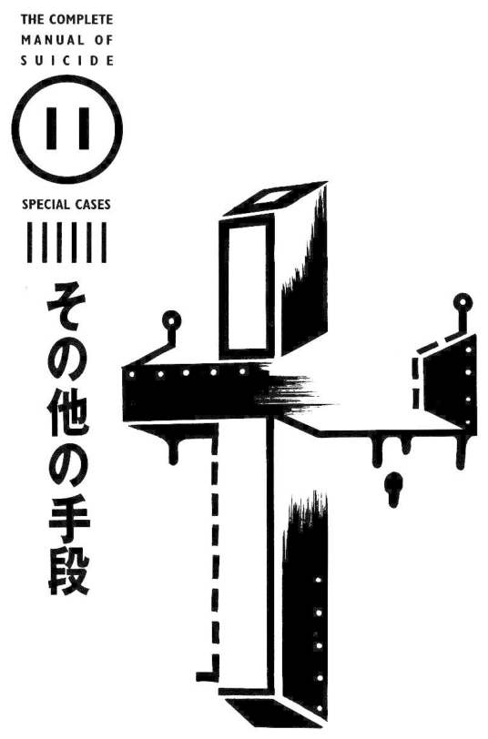

# 11. Special cases

There are many ways to commit suicide besides those introduced above. For example, suicide by gun, which is hard to obtain in Japan, is not described in detail here.

Movies and TV often show scenes of pointing a gun between the eyebrows or temples and pulling the trigger, which seems to be a typical method of committing suicide with a gun. However, this method of pulling the trigger is not recommended. Since the skull is much harder than one may imagine, if the angle is wrong, the bullet may bounce away. Even if it penetrates, the bullet will shatter, and the fragments will damage the brain in the skull, and then turn around and escape from the eyes or the other side, a failed attempt. If you want to use a gun, hold it in your mouth and shoot through the medulla oblongata of the back of the brain. This is the correct way.

In this chapter, let's learn about these other methods of suicide based on case studies.

## Case study 27: Sisters who starved to death in Toei apartment complex, Adachi Ward, Tokyo

| | |
| --- | --- |
| Pain | ▼▼▼▼▽ |
| Trouble | ▼▽▽▽▽ |
| Ugliness | ▼▼▼▽▽ |
| Ripple | ▼▽▽▽▽ |
| Impact | ▼▼▽▽▽ |
| Lethality | ▼▽▽▽▽ |

In August 1985, the decomposed bodies of two women were found in a room in Toei apartment complex (都営団地), Adachi Ward (足立区), Tokyo. This is a pair of sisters aged 25 and 23. The cause of death was starvation. The estimated time of death is from the end of 1984 to around February 1985. Next to the body, there is an old envelope with the words "I'll show you that I die." written by my sister.

The older sister struggled to pay the medical expenses of her mother and younger sister as well as the debts left by her father. Her positive and serious work attitude was well received by her workplace, but her monthly salary of 110,000 yen was insufficient for repaying the debt, so she had to borrow money. Soon the amount of the loan reached 3 million yen, and debt collection calls were made to the workplace. Even so, she still works diligently. The younger sister moved to this place with her parents and younger sister in 1965. Her mother was sick and her father was away from home for many years, so she had a monthly living allowance of 110,000 yen. My younger sister, who was already a bit schizophrenic, was often bullied after she entered middle school and often did not go to school. My older sister took care of her mother's illness while encouraging her younger sister. She also entered a vocational high school for commerce[^vocational-school]. However, when he was a senior in high school, his father came back with a large debt and died of cancer the following year. At this time, my sister suffered from hyperthyroidism again, and my sister's living allowance was canceled due to her employment.

[^vocational-school]: In Japan there are in general 3 kinds of high schools: general, where the students learn general subjects in preparation for entering a university; vocational, where the students learn practical skills in preparation for entering the workforce; others, which is a mixture of the two. There are different kinds of vocational high schools, such as commercial, industrial, agricultural, and fishery.

Her mother finally died of illness in 1983. However, her relatives did not allow her to take back the ashes. From about this time, the older sister also became tired of life. She placed garbage bags randomly on the balcony, received constant phone calls for debt collection, and began to miss work in June 1984. She was finally fired in September. Moreover, in September, the electricity and gas were cut off due to failure to pay on time, and in January of the following year, the tap water was also cut off. Debt collectors came to the house for days, so the two of them had to pretend to go out instead of taking out the trash. In October, they went to the neighbors to ask for food. Some days later, the neighbors came to them, worried, but they replied: "Don't worry about us anymore!". In fact, the idea of ​​committing suicide might had then been firmly established at this time. There is a local welfare office near the apartment complex, but they had never gone there to talk.

Probably the elder sister died after the younger sister. In the spring, due to the infestation of flies and the overwhelming stench, they were discovered. At that time, the younger sister was wearing a T-shirt and trousers and cuddled up against her elder sister. For some reason, the elder sister was naked, with upper body covered with a cardigan, and lower body uncovered.

The room was filled with garbage, bedding and clothes. There were also some magazines such as *Pia*[^pia], *Seventeen*[^subuntiin], and novels by Akagawa Jirou[^akagawa-jirou]. On the wall are large posters of Yumiko Ōshima[^yumiko-oushima] and the fantasy comic *The Star of Cottonland*[^cottonland].

[^pia]: "Pia" is a comprehensive entertainment information magazine published by Pia Coporotion from 1972 to 2011, mainly in the Tokyo metropolitan area. It was the first magazine in Japan to pioneer the genre of "information magazine", reaching its peak in the 1980s with a circulation of 500,000 copies. It had a great influence on the formation of Tokyo 's youth culture in the 1970s and 1980s.

[^subuntiin]: *Seventeen* (Japanese: セブンティーン, Hepburn: Sebuntīn) is a monthly Japanese fashion magazine for female teenagers published by Shueisha. Launched in 1967 as a weekly magazine based on the American magazine *Seventeen*, the magazine changed the name to SEVENTEEN in 1987, and to Seventeen in 2008. Since the late 1990s, Seventeen has been the highest-selling teenage fashion magazine in Japan

[^akagawa-jirou]: Jirō Akagawa (赤川 次郎, Akagawa Jirō, born February 29, 1948) is a Japanese novelist. His most recognized works to date is his Calico Cat Holmes series, about a hapless detective Katayama Yoshitaro and his cat Holmes, which has a sixth sense when it comes to solve mysteries.

[^yumiko-oushima]: Yumiko Ōshima (大島弓子, Ōshima Yumiko, born August 31, 1947) is a Japanese manga artist and is associated with the Year 24 group that heavily influenced the development of shōjo manga in the 1970s. She was the author of *The Star of Cottonland*.

[^cottonland]: 綿の国星 (Wata no Kunihoshi; "Cotton's Country Star" or "Planet of Cotton Country") is a Japanese manga series written and illustrated by Yumiko Ōshima. It was serialized by Hakusensha in LaLa magazine from 1978 to 1987 and collected in seven tankōbon volumes. The story is about an abandoned kitten called Chibi-neko (drawn as a small girl with cat ears and a tail) who is adopted by a young man named Tokio who grows up believing that she is human.

### Check: the cause of death

This is a staggering misfortune. Starving to death is a method that one would only choose after suffering all the hardships that life can give. Because they were so exhausted that they no longer had the strength to even commit suicide.

Although there are great differences between people, as long as you don't drink water, you will die in one to two weeks, and if you only drink water, you will starve to death in thirty to forty days. Energy storage is also a big factor. The sisters were a little obese and probably took longer to die than the average person.

All four members of this family have their own misfortunes, but the elder sister's misfortune is the most tragic. Her mother's illness, her father's debts, her younger sister's bullying and illness, all the misfortunes fell on her shoulders. No matter how hard she tried, she got no reward. Rather, the harder she tried, the worse the situation became.

Her life seemed to be at a crossroads of whether to commit suicide or not. Of course, it was possible for her to live, but she refused help and chose death. Faced with this kind of life, are there still people who would say such stupid things as "good things will happen only if you live", "you can do anything if you can die", "suicide is only for the weak"? To her "I'll show you that I die.", such people would have nothing to say in reply.

Some people say starvation is the best way to commit suicide. "Compared with other suicide methods, starving to death requires a lot of patience and perseverance. Even if you suddenly don't want to die, there will be no sequelae and you can recover quickly." We don't know if this is the case, though we can guess that the person who said this must have had some experience with this.

## Case study 28: Man who committed suicide in the quicksand of Tottori Sand Dunes

| | |
| --- | --- |
| Pain | ▼▼▼▼▽ |
| Trouble | ▼▼▼▼▼ |
| Ugliness | ▼▼▽▽▽ |
| Ripple | ▼▽▽▽▽ |
| Impact | ▼▼▼▽▽ |
| Lethality | ▼▼▼▽▽ |

In November 1988, a man's skeletal body was discovered in the Tottori Sand Dunes[^tottori]. At around one o'clock that afternoon, a local old man who was walking in an almost deserted place far away from the tourist routes found a skull slightly exposed in the sand. After calling the police, he unearthed a small shovel in his left hand, squatting as if holding it against his chest. Bodies in the sandpit.

[^tottori]: The Tottori Sand Dunes (鳥取砂丘, Tottori sakyū) are sand dunes located outside the city center of Tottori in Tottori Prefecture, Japan. At a length of 9 miles (14 km) and less than 1.5 miles (2.4 km) wide, it is the largest sand dune in Japan.

This man was a missing person in 1974, that is, fourteen years ago, due to a lovelorn relationship and illness. He was thirty-two years old at the time. One night he came to the sand dune, dug a hole about one meter deep on the slope of the dune with a shovel, squatted in, piled sand on himself with his hands, and then buried his head in the sand and suffocated to death.

A suicide note his parents received after his disappearance read: "Don't bother searching. It would be for nothing."

### Check: the cause of death

This is a thorough example of someone determined to erase himself from society.

Tottori Sand Dunes is a secret place in Japan that is as famous as the Aokigahara, but committing suicide by burying yourself alive in the quicksand of suffocation is extremely painful. Undiscovered for fourteen years, his goal can be said to have been achieved, but it is not a recommended method. Because there are still many ways to commit suicide without the body being discoverable.

## Case study 29: Woman mauled to death by bear cubs

| | |
| --- | --- |
| Pain | ▼▼▼▼▽ |
| Trouble | ▼▼▽▽▽ |
| Ugliness | ▼▼▼▼▽ |
| Ripple | ▼▼▽▽▽ |
| Impact | ▼▼▼▼▽ |
| Lethality | ▼▼▼▼▽ |

At about seven o'clock in the evening in February 1989, a 67-year-old housewife rushed towards the Aso Bear Ranch in the Zodiac Garden in Aso Town, Kumamoto Prefecture[^cuddly-dominion], about an hour and a half away from her home, and jumped into the bear cub pen.

[^cuddly-dominion]: The original text says "阿蘇クマ牧場十二支苑", which probably refers to 阿蘇カドリー・ドミニオン (Aso Cuddly Dominion), a petting zoo in the Zodiac Garden, under the Aso Volcano.

The keeper who heard the loud "pop" sound rushed over and saw only the bear shed 2.5 meters away from the fence. Sixty-eight bears were huddled together, like a small black mountain. After using a fire extinguisher to disperse the bear, a human body emerged from the white powder. The body had been torn apart by the cubs, the internal organs were completely missing, a large hole was opened from the stomach to the intestines, and there were several bite marks on the hands, feet and other parts of the body. Her clothes were torn into pieces, as if she were naked.

She was a devout Buddhist, and she has previously spoke of things like, "she will fall into the world of demons", "people die but their souls live forever", etc. When she left home that afternoon, she said, "They told me to go into that world." She also left a suicide note for her husband. Her neighbors also thought she was a weird person.

Some people said that this woman had said before, "I want to be eaten by a tiger."[^sattva] She also had thought about the tiger cage next to the bear shed, but because she could not get past the iron fence, she jumped into the bear shed.

[^sattva]:
    The Jātaka (meaning "Birth Story," "related to a birth") is a genre of literature native to the Indian subcontinent which mainly concern the previous births of Gautama Buddha in both human and animal form. It is one of the oldest classes of Buddhist literature.

    According to a Jātaka story, Prince Sattva is a previous incarnation of Gautama Buddha. On his walk with his closest disciple, he comes to the edge of a cliff, at the bottom of which is a starving tigress about to eat her newborn cubs in desperation. The bodhisattva tells his disciple to go look for food and he will stay and try to figure out a way to save her and her young. After some thinking, he leaps off the cliff to his death, and the tigress eats his body.

### Check: the cause of death

Committing suicide by being eaten by animals is an unexpected method. However, the motivation is a bit religious, and the way of death is too unrealistic, so it cannot be used as a reference for suicide methods. Moreover, this method is very painful, the corpse is horrible, and the reliability of death is not high, so I don't want to advise people to use it.

## Case study 30: American woman who died using a suicide device

| | |
| --- | --- |
| Pain | ▼▽▽▽▽ |
| Trouble | ▼▼▼▼▼ |
| Ugliness | ▼▽▽▽▽ |
| Ripple | ▼▽▽▽▽ |
| Impact | ▼▼▼▽▽ |
| Lethality | ▼▼▼▼▼ |

American pathologist Dr. Jack Kevorkian is famous for developing a unique suicide device "Thanatron". This device is a 30-centimeter-high design that contains physiological saline solution, Pentothal, and potassium chloride in three bottles that are hung upside down. Pentothal is an anesthetic used during surgery, and potassium chloride is a powerful drug used in poisoning and execution. Its structure is that after the suicide volunteer presses the button, the timer starts, and the saline water automatically changes to Pentothal. One minute later, the potassium chloride begins to flow into the body.

The person who committed suicide using this device in June 1990 was American housewife Janet Adkins (54 years old at the time). When she was diagnosed with Alzheimer's disease in 1989 and planned to commit suicide, she heard about Dr. Kevorkian's suicide device and got in touch. Dr. Kevorkian prepared a white German Volkswagen van and searched for a campground suitable for suicide. In June 1990, she and the doctor got into a car and drove to the park. She hid behind the car. The doctor first inserted the needle into the vein and injected the salt solution. When the doctor adjusted the flow, Janet pressed the button. The injection solution changed to Pentothal, and she fell asleep twenty seconds later, and then Pentothal was switched to potassium chloride. After forty seconds, her face turned red, and after another thirty seconds, it turned blue, and soon red spots appear. The electrocardiogram had completely become a straight line after five minutes and thirty seconds. In fact, her heart had stopped beating before that.

Janet was an English teacher and a serious woman with a passion for classical music, traits substantially affected by her Alzheimer's disease.

### Check: the cause of death

This is the "assisted suicide incident" that has sparked a debate on the right of dying with dignity across the United States.

At present, if you want to die completely reliably and safely, you have no other choice but to rely on Dr. Kevorkian's help. He also used this device to cause two women to commit suicide in October 1991, and there was an endless stream of people who came to him for consultation. He was able to use the device because the state of Michigan, where he lives, does not criminalize assisted suicide. In Japan, the criminal law clearly stipulates the crime of assisted suicide. That's why Janet went all the way from Oregon to Michigan.

There is no pain other than the poke of the needle, and you can die in your sleep, whether others see it or not. If you don't want to die in your room and are willing to go to the United States, you may wish to get in touch with the doctor. However, it is unclear whether he would be willing to use this device on people who are not suffering from terminal illnesses.

Japan also has a Japan Death with Dignity Association (日本尊厳死協会), but it only recognizes the right to die for terminally ill cancer patients who cannot be cured with current medical technology and is unwilling to take wasteful life-prolonging measures. It is opposed to euthanasia for the general public.

The contact address for the Japan Death with Dignity Association is as follows: 2nd Floor, Watanabe Building, 2-29-1 Hongo, Kyoto-dori, Tokyo, Postal Code: 113, Tel: 03-3818-6563.

## Case study 31: A man who committed suicide by gas poisoning in an attempt to defraud life insurance money

In October 1971, a 56-year-old man was found to have committed suicide by gas poisoning in a room of an apartment.

According to the investigation, the man signed up for insurance from three companies "Yasuda Life", "Daiichi Life" and "Daihyaku Mutual Life" from May to July, two years before his suicide. Family members can receive 72.6 million yen.

Before his death, he told people, "I want to leave the insurance money for my children when I die."

This man had suffered from tuberculosis for four years. Later, he became passionate about keirin cycling betting[^keirin], and his family was financially ruined. He caused great misfortune to his family and he felt ashamed and distressed. He was living away from his family when he committed suicide.

[^keirin]: Keirin is a Japanese form of bicycle racing sports, in which track cyclists sprint for victory following a speed-controlled start behind a motorized or non-motorized pacer. It was developed in Japan around 1948 for gambling purposes.

While working for a real estate company, he also took on side jobs as a bowling alley night guard and a life insurance salesman. He even borrowed money from relatives and friends to pay insurance premiums totaling 5.5 million yen.

According to colleagues at the real estate company, he was usually an honest kind of person, and seemed to not be a person who would do this kind of thing.

### Check: the cause of death

If it is a suicide using gas poisoning, the person who wants to commit suicide should also know something about life insurance; that's why I introduced this example. Life insurance benefits, even if the cause of death is suicide, will not be paid until one year after purchase. Moreover, the earlier the insurance money is collected, the more advantageous it is, so it is better to die immediately after one year after signing the contract. However, there is probably no one other than this man who would plan a suicide using such considerations.
