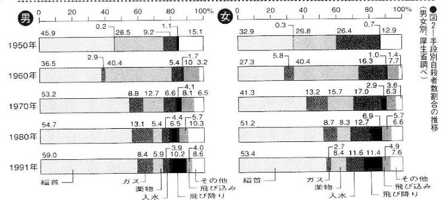
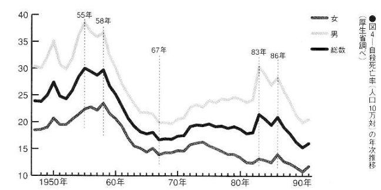

# Suicide statistics

The historical information is of great reference value for understanding the where and the how, so I summarize it.

First, classification by method. How did the suicides so far use to die?

The first place is hanging, followed by jumping. The other rankings are as follows:

| Year | 1950 | 1960 | 1970 | 1980 | 1991 |
| - | - | - | - | - | - |
| **Hanging** | 6641 | 6560 | 7542 | 10968 | 11313 |
| **Drug** | 4540 | 8135 | 2211 | 1335 | 1360 |
| **Jumping** | 152 | 281 | 562 | 1365 | 2119 |
| **Gas** | 39 | 834 | 1693 | 2342 | 1251 |
| **Drowning** | 2619 | 2029 | 1762 | 1543 | 1342 |
| **Vehicle** | - | 1816 | 1142 | 1166 | 865 |
| **Other** | 2320 | 488 | 816 | 1823 | 1625 |
| **Total** | 16311 | 20143 | 15728 | 20542 | 19875 |

According to statistics from the Ministry of Health and Welfare in 1991, there were 11,313 "hangings, strangulation, and suffocation" (hanging, strangling, suffocation by plastic bags, etc.), ranking first by a huge gap. The second was "falling from height" (2119 people), the third was (poisoning by) "solid or liquid" (1360 people), the fourth was "drowning" (1342 people), and the fifth was "gas or steam" (1251 people). Further down, there are 865 people who jumped into a volcano, 783 people who suffered "heat injuries (self-immolation)", 616 people who suffered "blade weapons and sharp objects" (i.e. cutting their wrists, etc.), and the 56 people who were electrocuted were the exceptional few.

Hanging had lost the top spot to poisoning from 1955 to 1960, but in 1980 it rose to the 10,000 mark, and its top spot was as solid as a rock. Jumping from a building also broke the 2,000 mark in 1986 when the popular singer Okada Yukiko jumped. The following year, it rose to second place and has since then remained stable, never been less than 2,000 people.

The wave of suicides caused by taking sleeping pills peaked in 1960. It once rose to the top of the list, but then declined, but for some reason it rebounded to more than 2,000 people between 1985 and 1987. However, Currently, there is a slight downward trend due to increasingly strict drug control. In 1960, there were more than 2,000 cases, but now the number has dropped to about 1,400. When gas poisoning became popular due to the expansion of natural gas infrastructure into households around 1975, there were records of 3,000 people using it. After urban gas supply has been converted to natural gas that does not contain carbon monoxide, only about 1,000 people per year die from gas suicide, using vehicle emissions. The ranking order generally remains unchanged. Please refer to Figure 2 for the changes in suicide methods between men and women.

The most striking difference between men and women is that women often commit suicide by throwing themselves into water or plastic bags. The majority of suicides are men all over the world. No matter which suicide method, the male:female ratio is basically 3:2 to 2:1. However, why for suicide by drowning, there are more women than man since ancient Japan? Regardless of whether the total number of suicides by drowning is greater or less, men commit suicide only 2/3 of women.

There are only about 100 to 200 suicides by suffocating with plastic bags every year, but most of them are done by women. The reason is completely unclear. As mentioned in the text, men commit suicide by electrocution in surprisingly many ways. There are only over a hundred electrocution suicides every year, of which only a dozen are female suicides each year, while men never account for less than 90% of the total. This is also an unsolved mystery among experts. Of course, some people say that the woman lacked knowledge about electricity, but the reason is not clear.

### Jumping off buildings is very popular with teenage females

No matter which age group, hanging is definitely the majority, but the majority are women in their teens and twenties. Since 1986, jumping from a building has exceeded hanging. Especially among teenagers, in 1990 there were 74 people who jumped from buildings and 31 people who hanged themselves. In 1986, the number was 162 to 78, a ratio of over 2:1. In 1985, only 52 teenage girls committed suicide by jumping from buildings. It goes without saying that this was due to the influence of Yukiko Okada, who committed suicide by jumping off a building. Her influence on the history of suicide in Japan is immeasurable.

In the past, as an example of exceeding the number of hangings, in 1960, when sleeping pills were at their peak, there were 1,311 people in their teens and twenties who hanged themselves, while the number of suicides caused by sleeping pills reached 3,889.

However, barring this exception, hanging always ranks first among all age groups at any time. It is said that suicide by handgun ranks first in the United States, of course because it is easy to obtain handguns. However, hanging is commonly used in other countries, including the United States, which shows that hanging is the most popular method of suicide.

## Time of suicide

### May is the peak time for suicides

Let’s first look at the months. All over the world, suicides tend to happen more in spring and autumn and less in summer and winter. At the same time, some reports say that there is more spring than autumn and less winter than summer, with the most in April, followed by May, and the least in December and January. However, no matter which month, the difference is not huge. According to Japanese statistics in recent years, May has the highest number of suicides.

According to the data of 1991, the situation of monthly suicides is shown in Figure 3. This year, there were most suicides in May and very few in February.

### Even Suicide rests on the seventh day

I compiled the data of more than 2,000 suicides handled by ambulance departments over the past six years in Tokyo. The order of suicides (completed and attempted) is Tuesday (15.3%), Monday (14.9%), Friday (14.5%), Sunday (13%), Saturday (13.8%).

A survey in a certain ward in Tokyo found that Thursdays had the most people, and Wednesdays and Sundays had the least. Counting only those who have actually died, Wednesday has the least number of completed suicides.

More than a hundred years ago, statistics compiled by the French sociologist Émile Durkheim showed that there were more people on Tuesdays and Thursdays and fewer people from Friday to Sunday. The fact that there are fewer Sundays is the same, and there is not much difference on other days.

### More suicides occur at night than during the day

According to the statistics on of 8,000 bodies processed by the Tokyo Metropolitan Medical Examiner's Office in 3 years starting at 1955, most cases are between 21 and 24 o'clock at night, and the least amount is in the early morning. Suicides caused by sleeping pills, which were very popular at the time, accounted for 36% of suicides between 21 and 24 o'clock, and 56% occurred between 21 and 3 o'clock.

In Kamakura, a survey of failed suicides show that most suicides happen at night, with fewer in the early morning and during the day. In a survey conducted in the Wards area of Tokyo Metropolis, they divided a day into 4 sections of 6 hours each, and found that the most frequent successful suicides happened between 12 and 18 o'clock (32.1%) and between 0 and 6 o'clock (27.4%), while the few were between 18 and 24 (19.0%) and 6 to 12 o'clock (21.4%). However, among those who failed, the time between 18 and 24 o'clock accounted for 31.0%, followed by 29.4% between 12 and 18 o'clock.

These findings are inconsistent and cannot be generalized, but it is at least plausible that suicide occurs more at night than in the morning.

However, the order of the survey conducted in Niigata Prefecture was 0 to 6 o'clock (29.4%), 12 to 18 o'clock (23.5%), 18 to 24 o'clock (21.6%), and 6 to 12 o'clock (17.6%). There are fewer between 5 and 12 hours, but they are roughly the same. It is difficult to analyze the results other than this. In areas where elderly people commit suicide more often in rural areas, the time of suicide can be said to be different from that in cities.

## Ranking on suicide

### Suicide is 2.5-times as common as homicide

So, are the number of suicides increasing? According to Figure 4, after the war, there were two peaks from 1955 to 1958 and from 1983 to 1986. In one year, there were The number of more than 20,000 deaths has been decreasing since then, with a slight increase in 1992. However, the increase in 1983 was thought to be due to loan sharks,[^sarakin] and in 1986 it was due to the influence of Okada Yukiko. Overall, it generally fluctuates based on 20,000 people. This is 1.5 to 2.0 times that of traffic accidents and 2.5 times that of homicides.

[^sarakin]:
    Sarakin (サラ金) is a Japanese term for a legal moneylender who makes unsecured loans at high interest. It is a contraction of the Japanese words for salaryman (サラリーマン, Sararīman) and loan (金融, kin'yu).
    
    Strict and often bullying loan collection techniques practiced by sarakin, combined with the importance in Japanese culture of "saving face", have driven many small-business men to despair and suicide. Many sarakin used to be affiliated with organized crime groups (yakuza) and a scandal blew up in the early 1980s because of their unsavory, if effective, collection methods, such as showing up at a funeral or wedding to demand money, or using a loudspeaker in front of homes, schools or workplaces to broadcast non-payment of debt. These actions led to the term sarakin-jigoku (サラ金地獄), or "loan shark hell", being coined by the media and legislation which set the code of conduct for money collection.

### Suicide ranks among the top among those aged 20 to 30

In terms of causes of death, suicide ranks seventh in the past ten years, following cancer, heart disease, cerebral hemorrhage, pneumonia, bronchitis, accidents, and aging. In the post-war period, many people died from tuberculosis and gastroenteritis, so the order is still behind them. However, looking at age groups, records in recent years show that suicide ranks first or second behind accidents or cancer among those in their 20s and 30s. Among those aged 15 to 19 and 40 to 44, they also ranked third. Among the elderly, who have a high suicide rate, the ranking of suicides declines with age. This is the reason why the Statistics and Information Department of the Ministry of Health and Welfare said, "It may not be correct to say that most suicides are elderly based on numbers alone."

Cancer, which ranks first, kills more than 10,000 people in their 40s. But as people in their 50s, 60s, and 70s, the number of deaths increases to 20,000, 40,000, and 60,000. At the same time, the ranking order of suicide is fifth, sixth, and seventh.

Specifically, looking at the figures in 1991, there were 962 suicides among people aged 20 to 24. The mortality rate per 100,000 people in this age group was 10.4%, ranking second. The number of people aged 70 to 74 was 1,188, with a mortality rate of 30.5%, ranking ninth. Indeed, the suicide index is high in proportion to the population. However, if someone asks who has died the most by suicide, this ranking is an important answer. It can be said that the younger generation from ten to thirty years old has the largest number of deaths by suicide.

## Suicides around the world

### An incomprehensible country of suicides -- Hungary

Even according to Japan's statistical method, the difference between that of the Ministry of Health and Welfare and that of the National Police Agency is more than 1,000 among 20,000 people. To usefully compare the statistics collected by different countries would be even more difficult, but it is interesting to look at anyway.

According to the suicide mortality rate (number of suicide deaths per 100,000 people) according to the latest data from the WHO (World Health Organization), Hungary, known as a country with a large number of suicides, ranks first, accounting for 39.9 (1990 survey). Men alone account for a staggering 59.9. The following are Sri Lanka's 33.2 (1986), Finland's 28.5 (1989), Denmark's 24.1 (1990), Austria's 23.6 (1990), 21.8 of the former Soviet Union (1990) and 21.9 of Switzerland (1990). On the contrary, Greece has very little, only 3.8 (in 1989), which can be said to be terrifyingly small. The others are Israel's 6.8 (1988), Argentina's 7.4 (1987), the United Kingdom's 8.1 (1990), Portugal's 8.8 (1990), Puerto Rico 8.9 (1989), the Netherlands 10.2 (1989), Hong Kong 10.5 (1989), etc. To sum up, the numbers are foggy, and there is no need to analyze them closely.

Among major countries, Japan was 16.4 (1990), the United States was 12.4 (1988), France was 20.9 (1989), and China was 17.1 (1989). It is a characteristic of China that there are more female suicides in China (unlike in other countries). In Canada, it was 13.3 (in 1989). Japan, which jumped to first place during the second peak of sleeping pill suicides and was known as the "suicide country", is currently in the middle of the ranking.

### Guns for America, noose for Germany

It is also interesting that the means of suicide vary from country to country.

According to the current statistics, the United States uses shooting, Italy, which has the water capital Venice, uses water, and Germany uses hanging. According to recent data, 47.1% of suicides in the United States are caused by guns and explosives, which is indeed a lot. The next highest is taking poison. Gas is 20.8%. Hanging is 20.5%. Other methods are quite rare. For Italy, Switzerland, Canada, and Australia, it's said that most suicides are by gun.

According to data from West Germany in 1969, hanging accounted for an absolute majority of 39% of all cases. The following is taking poison. Sleeping pills are 23%, gas is 13%, and drowning is 9%. Of course, there are also regional differences. Berlin has the most gas and Hamburg has the most sleeping pills. The similarity with Japan is that only 5% of people jump from buildings. Also in Sweden and Denmark, hanging is the most common.

Data from England and Wales in the United Kingdom in 1965 showed that among men, 34% were gas, followed by drugs 25%, hanging 13%. For women, drugs account for 49% and gas accounts for 33%. Somehow these two are surprisingly numerous, while other methods are all in single digits.

Drugs for France. According to data from 1966 and 1970, the first place is drugs, the second place is sharp knives, and the third place is gas. Women use drugs more often.

Drugs for India too. According to statistics in 1966, although only 912 suicides were recorded, the proportion was 46% with drugs, 22% with drowning, and 14% with hanging.

In Nigeria, Africa, according to data published in 1962 and others, in descending order: hanging (up to 50%), guns, poisons, and sharp knives.

The above situation seems to reflect various national conditions.

### Golden Gate Bridge, a death-inducing stunning scenery

As in Japan, there are of course tourist attractions for suicides outside of Japan.

The most famous one is the Golden Gate Bridge in San Francisco, USA. Many people who commit suicide there say that they did not come here for the purpose of committing suicide, but witnessing the stunning scenery, they were struck with suicidal thoughts just by the atmosphere. A 70-year-old man left a suicide note saying "How is it that this scenery was created, that makes it so easy to suicide in?" and jumped off. Similarly, Niagara Falls in the United States is also known as a suicide tourist attraction. The Thames River in the United Kingdom and the Ganges River in India have all been called suicide attractions. In Japan, a counterpart could be the Kegon Falls (華厳滝) (See Chapter 3).
