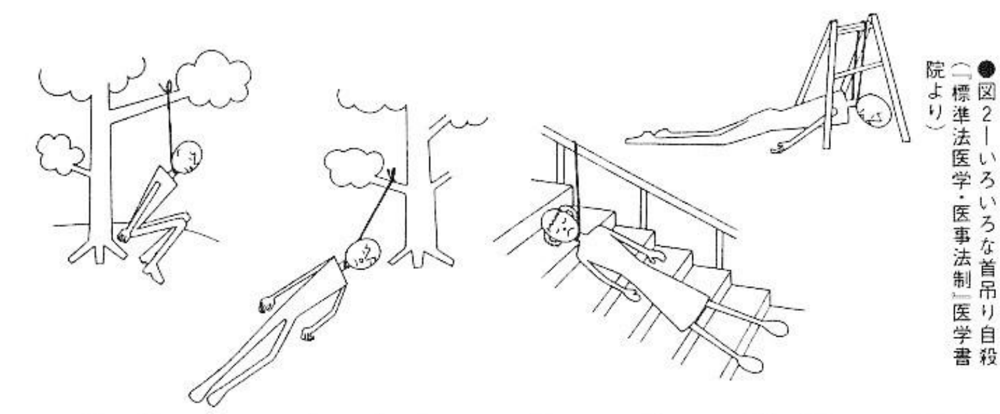

# 2. Hanging

| | |
| --- | --- |
| Pain | ▼▽▽▽▽ |
| Trouble | ▼▼▽▽▽ |
| Death state | ▼▼▼▽▽ |
| Implicated | ▼▽▽▽▽ |
| Impact | ▼▼▽▽▽ |
|Lethality | ▼▼▼▼▼ |

The triple benefits of certainty, simplicity, and painlessness is overwhelmingly loved by men, women, and children alike, and can be called the "Monarch of Suicide."

It may seem like I'm making an unfounded conclusion, but there is no safer, more reliable, and easier way to commit suicide than hanging. There is actually no need to consider any other method. You may not believe it, but after careful investigation, I still haven’t found a better method than hanging. The following will also describe in detail why hanging is superior to other methods. It can even be said that hanging is a work of art imagined by humans. Because of this, half of the suicides in Japan every year choose this method, and it has been widely used both at home and abroad in ancient and modern times.

The biggest advantage of hanging is that the failure rate is extremely low. As long as the rope is intact, the branches around the rope are not broken, and the hanging is not discovered within ten minutes after hanging, the success rate is basicaly 100%. There was a person who took poison and then seppuku, but did not die, then he waited for the train on the track but it didn't come. Out of options, he went to jump off a cliff, and did not die either. Finally, he successfully hanged himself from a tree on the cliff.

"If you want to die, hang yourself." People who are planning to commit suicide should burn this into their minds.

## Preparation: Simply a rope

All you need is a piece of rope. Wires, belts, ropes, anything that can be wrapped around your neck. However, try to choose something that is soft and can lie flat against your neck. Such as the plastic tape used for packaging in department stores, etc., which is enough even for a person weighing more than 100 kilograms. If something with cutting force, such as a steel wire, is used, the head and neck may be severed. Someone took a steel cable for pulling vehicles, tied one end to the bridge railing, the other end around his neck, and then jumped into the river. As a result, his head was sliced off and flowed down the river, becoming an "unexplained mysterious death" and occupied the local headlines for a while. There was also a very courageous company employee who tied a vehicle-pulling cable to a tree, put the other end around his neck, started the vehicle, and decapitated himself.

You can tie the rope while you are sitting or even lying down, as long as it is not a thin branch that is easy to break. There was a boy in 7th grade who hanged himself by nailing a nail to the bookshelf. However, it is often difficult to find a suitable place to put a rope, especially in hospitals and detention centers. However, hanging does not require that the rope be tied to a place higher than your body length. Even if your feet or buttocks touch the floor, you can still die. There are some people who hang themselves on hospital beds, and this is also theoretically explainable.

Before explaining this theory, let’s talk about the differences between the cause of death by strangulation and hanging. The former is mostly caused by suffocation by blocking the trachea, while the latter is mostly caused by the lack of oxygen in the brain by blocking blood flow to the brain.

There are two types of arteries that supply blood to the brain: the carotid artery and the vertebral artery, which is protected by bone next to the spine. Even if the carotid artery is blocked by strangulation, the vertebral artery protected by the bone cannot be blocked. However, in the way of hanging, the neck is hung diagonally upward to form an angle, so both arteries are blocked together, and the blood supply to the brain stops instantly (see Figure 1).[^carotid-artery] The difference between the two can be seen from the corpse. Although the blood supply from the vertebral arteries to the brain of the strangled corpse continued, on the contrary, the carotid arteries that carried blood from the brain were blocked, so they turned purple and had blood stuck in the head; in the hanging method, there was no blood stuck in the head. Now that we have clarified some basic issues, let’s return to the issue of the height of hanging.

[^carotid-artery]: The picture looks really weird to me. According to the picture, hanging would make the spinal cord go all "Z"-shaped, and that just seems patently untrue. If it does happen, it would cause permanent paralysis, but some people rescued make a full recovery. I think the picture is just wrong.

When hanging, for a person whose blood pressure is 170 mmHg, it takes 3.5 kg of force to block the carotid artery and 16.6 kg of force to block the vertebral artery. If your feet are on the ground and your knees are bent, 70 to 90% of your body weight (20% of your body weight when your knees are on the ground) is pressed against your neck. For example, when a person weighing 60 kg hangs with his knees on the ground, the force pressing on his neck is 12 kg, and the carotid artery will naturally be blocked. At this time, the vertebral artery has not yet reached the point of complete blockage, so a small amount of blood flows to the brain, but this is only a matter of time, and it is several times better than simple strangulation. Loss of consciousness may come later, but nothing ends in a near miss. In other words, even if the force pressing on the neck is only 20% of the body weight, as long as the neck is at an angle, death can be easily achieved without completely lifting the body.

In fact, there are examples of people with their buttocks and back on the floor (refer to Figure 3). Some people say that as long as the height is above 30 cm, you can die. Some people even say that in Europe and the United States, more hanging suicides have their feet touching the ground than not. If you plan to die in your room, there is no need to give up because you feel the height is not enough. A door handle is enough, and using the slope of the stairs is also a good idea.

Another thing that should be noted is that although it is necessary to find a place where it is not easy to be discovered, it is not like suicide by gas or drugs, which requires a place where it cannot be discovered for several hours or days. It would be impossible to save you if you are not discovered within ten minutes. More than 30 minutes and it would be a complete success.

If you don’t want your relatives and friends to see your body, it’s best to choose a place a little further away from your home and your daily commute to work and school. When you are identified and your parents know about it, you are already in the hospital or the police station.

## Experience: Instant loss of consciousness, no pain

How would you feel if you put a rope around your neck, kicked off the footstool and hung in mid-air?

According to research by forensic scientists, it is common knowledge in the medical community that once someone hangs himself, his consciousness becomes hazy and his hands and feet cannot move even if he wants to. Moreover, there is no pain at all during the process.

In Tokyo, an actor performed hanging in front of the audience. The moment he said, "Squat down like this..." he lost consciousness and died in front of the audience. A forensic scientist wanted to experience the pain of hanging. He placed a footstool in a position where he could stand on it at any time and asked his colleagues to be present. As soon as his feet left the footstool, he suddenly lost consciousness. Fortunately, he was saved by his colleagues. There are many examples of similar experiences.

A suicide attempter who was rescued from hanging with a wire said: "My head was buzzing and I didn't know anything. I had no consciousness. Though I couldn't breathe and reasonably would have felt bad or painful, I felt no such thing."

It's not just not painful, it's can also be quite comfortable. For example, the thrill of being thrown unconscious by a choke-hold in judo, or the case of a boy who hanged himself while playing a choking game with a towel in the bathroom.

At the same time, if you hang too hard all at once, the neck joints will dislocate, immediately leading to cardiac arrest and respiratory arrest.

When it comes to hanging, many people think of being strangled by the throat and suffocating to death in pain. In fact, before you feel out of breath, your brain is deprived of oxygen and you lose consciousness, so there is no pain.

If you doubt this statement, you can put a rope around your neck and hang yourself to see if you really would lose consciousness in an instant. Maybe as soon as you put on the rope and put some weight on it, you will stop the experiment immediately because you feel more nervous and scared than you thought!

## Heart stops in about ten minutes

Some scholars have further divided it into several stages and conducted detailed research.

The first stage starts with a buzzing head and tinnitus. Then a flash of light in front of eyes, head felt hot, ears ringing, and flashing lights in eyes. At the same time, consciousness began to blur.

In the second stage after losing consciousness, convulsions occur throughout the body. It is said that the hands make paddling movements and the feet make walking movements, and then the muscles of both hands and feet begin to cramp, and then the whole body straightens up and cramps. But for this spasm, I now think it is a small tremor in the whole body. This stage lasts from one minute to one and a half minutes. What is puzzling is that men will have an erection and ejaculate at this time.

In the third stage, it is already in a state of suspended animation, with urine, feces and semen leaking, eyeballs protruding, and breathing stopped. This takes about a minute, so it only takes three to three and a half minutes to get to this point. The heart is still beating at this stage and a life may be saved if found. The heart will beat for about ten minutes. Once the heart stops beating, there is no hope of rescue.

There was an American acrobat who imitated hanging in front of the audience. His usual arrangement was to give a prearranged secret signal to his assistant as soon as his consciousness began to blur. One day, he unexpectedly lost consciousness and failed to give the signal in time. He hung there for thirteen minutes and did not revive when he was sent to the hospital.

This means that in just ten minutes, if no one detects it, your suicide will be successful and painless. There is probably no more suitable way to commit suicide than this!

## Appearance: Is a hanged corpse unclean?

The disadvantage of hanging that people often mention is that the corpse looks bad. Incontinence and ejaculation do occur. Some people say that because the throat is strangled upward, the tongue will stick out, the face will turn purple due to congestion, and the eyeballs will protrude. However, there are not many horrific examples of this. The eyeballs will not protrude until several days after death, and the tongue will not stick out even if it touches the teeth. That is to say, the condition of the corpse is usually not like this.

Judging from the photos of hanged corpses, most of them are just hanging there, no different from when they were alive. As mentioned before, because the blood supply to the head is quickly cut off, there is generally no congestion on the face. Although it doesn't look very good, compared with the corpses that jumped from buildings or crashed into cars, it can be said to look decent enough.

To prevent incontinence, go to the bathroom beforehand. If you don't want to ejaculate, masturbate first. To follow Emperor Hirohito who died on 7 January 1989, a 87-year-old man committed suicide on the day of his death. He hung himself in an orange grove with gauze in his mouth and a mask. Such elaborate preparations... let's leave it at that.

## Note: Strangulation is painful

As mentioned before, the advantage of hanging is that the vertebral artery is blocked due to the posture of pulling the neck from above. Of course, if you strangle your neck with your hands, this artery cannot be blocked, so the blood supply to the brain cannot cause you to lose consciousness all of a sudden. In the case of hanging, the person loses consciousness in the first stage as mentioned above. In the case of strangulation, the person experiences the first, second and third stages while being conscious, and then finally loses consciousness. The result is that the trachea is blocked and suffocates, and cramps are experienced, which is accompanied by considerable pain. Even so, there are many people who commit suicide by strangulating their necks and suffocating themselves. I couldn't help but express my sympathy to him, why didn't they spend some time to create a height of 30 centimeters!?

A 42-year-old university associate professor tightened his tie bit by bit, and finally died of bleeding from his mouth.

A 43-year-old woman who participated in the Tokyo Olympics swimming competition and lived a mundane housewife life since then, made full use of her extraordinary lung capacity and suffocated to death by wrapping multiple layers of tape on her mouth, nose, and neck.

A 49-year-old housewife who was imprisoned for killing her son died of suffocation after stuffing enough toilet paper into her stomach and nose in the detention center.

There is also a 46-year-old construction worker who committed suicide due to bronchial occlusion after swallowing about 100 g (about a roll) of toilet paper in the police custody room.

Of course, you can die using this method of suffocation, but it is accompanied by considerable pain, and I am not willing to recommend it.

Regarding hanging, it should also be mentioned that due to the formation of a hypoxic state inside the brain and the destruction of cells, serious neurological sequelae will be left after a failed attempt. The characteristics of brain cells are different from other cells. They cannot regenerate if they are destroyed.[^cns-regeneration] Therefore, it is necessary to make careful arrangements not to be discovered.

[^cns-regeneration]:
    Unlike peripheral nervous system injury, injury to the central nervous system is not followed by extensive regeneration. It is limited by the inhibitory influences of the glial and extracellular environment. The environment within the CNS, especially following trauma, counteracts the repair of myelin and neurons.

## Case Study 4: Tragedy of attempted hanging -- Frank Nagai

In October 1985, singer Frank Nagai (フランク 永井) (53 years old at the time) returned home from a performance at around 10 in the evening. He drank a little beer with his wife and went to bed around 10:30. But in the middle of the night, after walking out of the bedroom, he did not come back for a long time. When his wife came out to search, she found that he was hanging with four or five ties on the handrail of the spiral staircase between the first and second floors. It was around 3 in the morning. When the ambulance arrived, Nagai had no breathing or pulse and fell unconscious. When he was sent to the hospital, his pupils were dilated and he was in a state of "imminent brain death." But after four or five days, he miraculously regained consciousness. After a month, he could speak a few words, and when he saw the title of the song "君恋し", he could still recognize the character "君". Later, he could write "Nagai" (永井) from his name. Later, he was hospitalized and discharged several times. He is now able to do some walking and sing familiar songs on karaoke, which shows further recovery. Despite this, he could not recognize his wife and friends who came to visit him, and he was in a state of Alzheimer's disease. In 1989, he became a *kinchisansha*, a legally incompetent person who was not allowed to handle his own affairs[^kinchisansha].

[^kinchisansha]:
    > In Japan, people who are adult wards (成年被後見人, seinen hikōken nin)(formerly known as 'legally incompetent individuals' (禁治産者, kinchisansha)) were deprived of the right to vote until 2013. They are citizens who make use of the adult guardianship system because they have dementia, an intellectual disability, or a mental disability that makes it difficult for them to manage their assets or their daily lives by themselves.

    Okura, Sae. "The last suffrage movement in Japan: Voting rights for persons under guardianship." Contemporary Japan 30.2 (2018): 189-203.

When he told his friend Tetsurou Tanba about this experience, he said this: "I had difficulty breathing as soon as I hanged myself, and my vision instantly turned red and then completely black. I saw my face tilted in the air, and gradually I heard a strange sound. The sound gradually grew louder and disappeared into the dark tunnel. I suddenly rose up, floating through the walls and doors, and could see the situation in the lower world. Suddenly I noticed that I was standing on the ground and heard from the front garden a beautiful music, I also heard the voices of my deceased friends and relatives, and I was driven forward by the feeling of nostalgia and reunion. There, the Sanzu River stood[^sanzu-river], but an unknown force pulled me back.”

[^sanzu-river]:
    The Sanzu-no-Kawa (三途の川, lit. "River of Three Crossings", or the "Sanzu River") is a mythological river in Japanese Buddhist tradition similar to the Chinese concept of Huang Quan (Yellow Springs), Indian concept of the Vaitarani and Greek concept of the Styx.

    Similarly to the Sanzu-no-Kawa, there is also the Sai no Kawara (賽の河原, lit. "Riverbed of Death"), a boundary by which the souls of children who died too early cross over to the realm of the Dead, with the help of Jizō, a Kami/Bodhisattva who helps the souls of children who died too early to avoid the attentions of the Oni and of Shozuka-no-Baba and Datsueba.

Nagai attempted suicide because her former lover claimed that the child she gave birth to was theirs, and he was distressed by the demanded child support.

### Check: this example

This is probably the only case of attempted hanging that is publicly sensational. Even if the success rate of hanging is close to 100%, it will not be successful if it is discovered quickly. Judging from the absence of pulse in the above example, the patient may have been hanging for more than ten minutes. However, some experts believe that "(Judging from the current state of recovery), the time when he was found was just three to four minutes after hanging, and his feet and buttocks should have been on the ground. However, even if his life is saved, the damaged brain nerves will not regenerate." The kind of sequelae it will leave is shown by Nagai's situation. The nerve cells in the brain begin to die the moment blood no longer circulates. It is very scary. Failed hanging is very scary!

According to his own account, he lost consciousness in an instant (at the usual level), and his vision turns red and then black. The wonderful experiences that follow can be called "near-death experiences". It is said that many people who are on the verge of death have experienced them.

## Case Study 5: Hanging at a height of 91 centimeters -- Tsuneo Mori, Chairman of the Central Committee of the New Party of the United Red Army[^long-title]

[^long-title]:
    Apologies for the ridiculously long title, but communists have a tendency to create very long titles, especially with their tendency to split groups into subgroups.

    In short, the United Red Army was a merger of two groups, the Marxist--Leninist--Maoist Red Army Faction led by Tsuneo Mori, and the Revolutionary Left Faction led by Hiroko Nagata.
    
    The Red Army Faction was an organization led by Japanese college students after having split from its parent group, the Communist League of Japan. This split came as a result of a tense disagreement regarding the militant policies the Red Army Faction had adopted. The group consisted mainly of students from regional Japan that attended elite universities with the intention to "do something bold and different that would move the process of revolution forward".

    The Revolutionary Left group split off from the Japanese Communist Party after World War II. It escalated violence with the intentions of obtaining weaponry, such as with their gun shop robbery of 1971.

    Sometime around the start of 1972, the United Red Army split into two groups again. One group was led by Tsuneo Mori and called itself the "New Party". I have no idea what is going on. Too many splittings.
    

On January 1, 1973, Tsuneo Mori (森 恒夫) (28 years old at the time), who was in the Tokyo Detention Center, hanged himself in a single cell. He himself was a member of an armed revolutionary group formed in January 1972. His "only-gunnism"[^yuijyuu-shugi] advocated that revolution can only succeed by relying on guns. He conducted armed training at the underground headquarters in the mountains of Gunma Prefecture and was arrested in February 1972. He confessed that he had killed twelve "Red Army soldiers" on the grounds that "the action was not revolutionary." In September, he was transferred to the Tokyo Detention Center, awaiting trial. This incident of lynching and torture of twelve people was more "madness in a closed group" than the Asama-sansou hostage crisis[^asama-sansou], and it shocked Japanese society for a while. On January 1, 1973, Tsuneo Mori ate both breakfast and lunch as usual. At 01:38 in the afternoon, the guard on patrol saw him sitting on a tatami mat reading a book. But fourteen minutes later, at 01:52, when the guard visited the single cell again, he had already tied a knot with a 60-centimeter-long towel on the 91-centimeter-high iron railing, put his head in it, and hanged himself. The doctor came and gave him cardiac resuscitation drug injections and artificial respiration, but to no avail, and he died about an hour later. It is said that he tied his legs with the clothes around him and stretched them there, forming a "く" shape and hanging there. Some people say that when he died, his shape seemed to be "about to sit down." The analysis of this suicide is that when he committed suicide, he "kicked his tied feet into the air hard, so gravity added to the towel and strangled his neck." Although he was unconscious when he was found, his veins were the same as in a living body, and no bleeding or incontinence was found.

[^asama-sansou]: The Asama-Sansō incident was a hostage crisis and police siege at a mountain lodge near Karuizawa in Nagano Prefecture, Japan, which lasted from February 19 to February 28, 1972. The police rescue operation on the final day of the standoff was the first marathon live television broadcast in Japan, lasting 10 hours and 40 minutes. The incident began when five armed members of the United Red Army, following a bloody purge that left fourteen members of the group plus one bystander dead, broke into a holiday lodge below Mount Asama, taking the wife of the lodge-keeper as a hostage. A standoff between Japanese police and the URA radicals took place, lasting ten days. The lodge was a natural fortress, solidly constructed of thick concrete on a steep hillside with only one entrance, which, along with their guns, enabled the hostage-takers to keep police at a distance. On February 28, the police stormed the lodge.

He left two suicide notes, the content of which is said to be an admission of the error of only-gunnism. I also heard that he loved reading the Bible a few months before his suicide and became very interested in Christianity.

[^yuijyuu-shugi]:
    唯銃主義 (yuijyuu shugi), can be literally translated as "only gun-ism". It is a word invented by Tsuneo Mori, probably in imitation to 唯物主義 (materialism) and 唯心主義 (idealism).

    It seems like the same idea as Mao Zedong's "Political power grows out of the barrel of a gun." It is reasonable to guess that Tsuneo learned it from Maoism, because he was a leader of the Marxist--Leninist--Maoist Red Army Faction.

### Check: the cause of death

Did his buttock touch the ground?

He was a small man, with 163 cm and 54 kg. The towel he uses is 60 cm, which is also very short. He tied a knot around the railing and put it around his neck so his neck rested tightly on the railing. Coincidentally, his waist is very long, and the towel is tightened around his neck, so his buttocks may not even touch the ground. That is to say, it is impossible for a man weighing 54 kg to wake up after 14 minutes by hanging with his feet on the ground and his back against the wall. This is strong evidence that hanging is easy and can stop breathing in a short time. Having said that, after unremitting efforts and hardships for the revolution, he finally gave up his long-held belief and surrendered to God. However, he committed suicide without being rescued. How pitiful it must be.

However, even though it happened twenty years ago, the Red Army cadres believing that they could start a communist revolution is a far crazier thing than their killing of twelve of their own members.

## Case Study 6: Woman rescued from hanging in psychiatric hospital

May 17, 1982, 4:45 pm. In a mental hospital, a woman who was hospitalized fell into a state of excitement and shouted, "Kill me!" and was sent to the protection room. Forty minutes later, at 5:25, I climbed onto the window pane covered with several quilts and hung myself with a towel. When he was discovered, his breathing and heart had stopped. He was rescued and given artificial respiration and cardiotonic drugs. Five minutes later, spontaneous respiration and a weak pulse appeared. Despite this, she was unconscious for two whole days, and finally responded to the stimulation on the third day. She regained consciousness on the fourth day, could eat and drink fluids after a week, started "self-recovery training" on the second week, and was able to live in a group life with other patients after another two weeks. However, her memory has declined, lost her former enthusiasm. She always hid behind others, and became more dependent on her caregiver.

This woman had been admitted to this hospital for 13 years after she turned 26, and had been admitted to other psychiatric hospitals three times before that. After being discharged from the hospital in 1979, she went to work in a nearby general hospital. She gave up his job due to friction with a male employee in the unit and lived with another man. Soon she started not eating and shouted, "Kill me!" Two years later, she was hospitalized again. The hanging occurred six months later. This was her third suicide attempt.

She had worked in a towel factory for six years after graduating from high school, got married at the age of 23, divorced the next year, gave birth to a boy, but the child died soon after. Also, four of her five sisters, including her, had had attempted suicide.

### Check: this example

As the nurses said: "It is one of the few rare cases where the patient was brought back to life due to rapid treatment by medical staff upon discovery." It is also a rare case where death was not achieved even though the heart had stopped for a while. From the unrecorded forty minutes, subtract the time for stacking quilts, we see that it should be about fifteen minutes after hanging when she was found, at which point her heart probably had just stopped. Although it had forty minutes and sufficient height, it failed to cause death. This is in sharp contrast to the case of Tsuneo Mori. It is very difficult to commit suicide in a hospital or prison cell because of surveillance. It is especially difficult to commit suicide in a hospital because of its complete first-aid facilities.

Judging from these attempted cases, perhaps thinking of hanging yourself is not that simple. But, after all, these are extremely rare examples. Judging from the fact that more than 10,000 people die from hanging every year, and the success rate is almost 100%, hanging is still the top method of suicide.

But what was the rest of her life about? It was far beyond misfortune or bad luck. From the outside, this looks like a "living hell". Judging from the sequelae left behind, it might be better not to save her.
