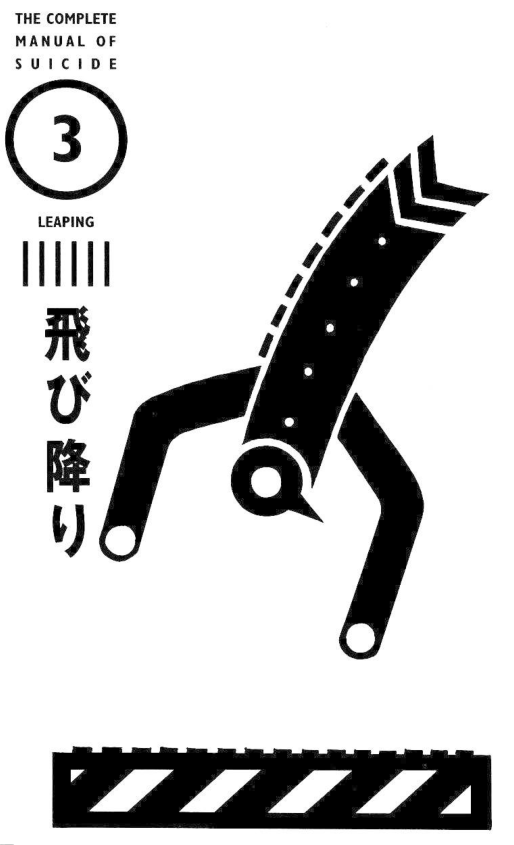
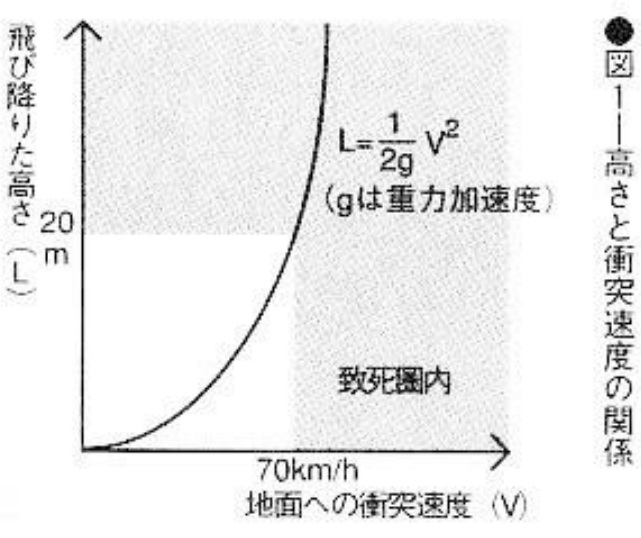
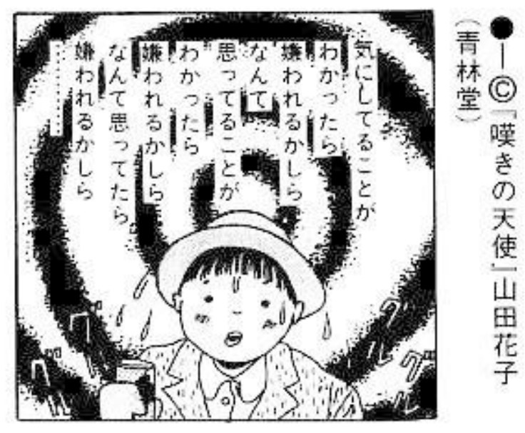
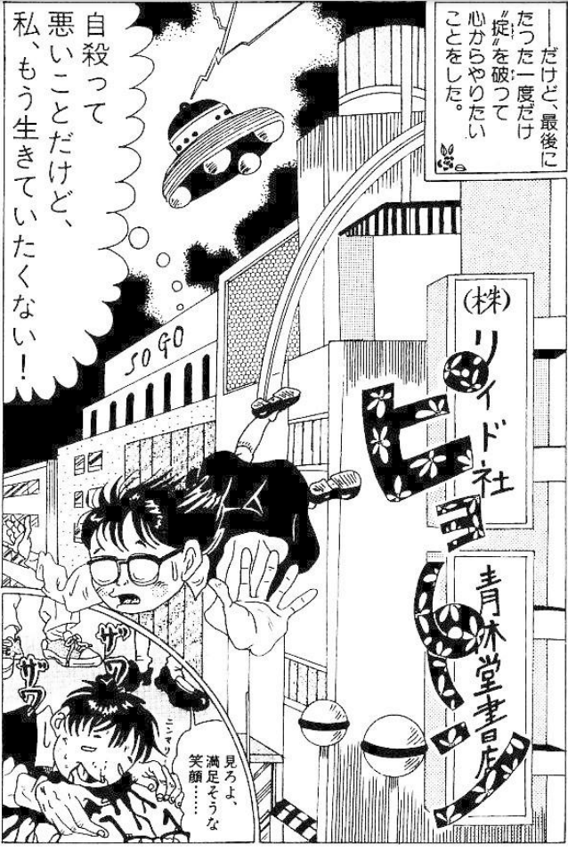

# 3. Leaping

| | |
| --- | --- |
| Pain | ▼▽▽▽▽ |
| Trouble | ▼▽▽▽▽ |
| Death state | ▼▼▼▽▽ |
| Implicated | ▼▼▼▽▽ |
| Impact | ▼▼▼▼▽ |
| Lethality | ▼▼▼▼▽ |

Jumping off suddenly is painless. It is highly lethal and is the most high-modern method of suicide. It is not painful to suicide by jumping off a building or a cliff.

There is no pain, no discomfort, and even no terror. Not only that, it can even be very enjoyable. This is not a metaphor, it is actually true. It sounds a bit nonsense, but if you put the words of those "fallen" people together, it can only be said to be this way. This point will be described in detail below, but in this way, suicide by jumping off a building or a cliff can be said to be an excellent method comparable to suicide by hanging. Jumping from buildings and cliffs does not have the shadow that comes with other means of suicide.

The person who completely changed the concept of suicide by jumping off a building and a cliff was a girl named Sato Kayo. In 1903, a young man, Misao Fujimura, jumped from Kegon Falls, wrote in his celebrated suicide note: "The true nature of the whole creation. Is in one word – 'unfathomable'.". It gives suicide a noble image of philosophy, different from the past. Just like the successors who continue to appear, Satō Kayo also gave falling suicide a certain sacred image, attracting followers one after another, and even the myth "she fell, she jumped" appeared. Satō Kayo is the real name of popular singer Yukiko Okada.

Perhaps for this reason, regardless of age or sex, jumping off a building or a cliff is second only to hanging. Young people and girls are particularly fond of this method, and women are more likely to do so. This method is on the rise, and now 50% of female suicides, including teenage girls, commit suicide by falling, far ahead of other suicide methods.

The earliest person to jump from a building is said to be a male employee of a company who jumped from the seventh floor roof of Ginza Matsusakaya Department Store to Ginza Street in 1935. The shift from Kegon Falls or Kinpo in the past to high-rise buildings represented by Takashimadaira community is closely related to urbanization and is also one of the phenomena of urban modernization. The day after Okada Yukiko committed suicide, that is, April 11, 1986, the 18-year-old girl took her sister's hand and left her to leave the community "in order to understand her superpowers in her previous life." jumped to his death from the rooftop.

## Preparation

### Requires a height of 20 meters above the ground58

When jumping from a tall building, you should check the necessary height and the conditions of the landing site beforehand. There are many suicide attempts, mostly because they fail to maintain the necessary height. If you really want to die, you should jump from a height of more than 20 meters from the ground, that is, from about seven to eight floors above. If the ground is concrete, it cannot be saved. Jumping from the fourth floor, the success rate is only about 50%. Incidentally, each additional floor is three meters higher, which may be used as a basis for conversion.

It is also very important to check the landing place. There is no small bush downstairs. A 16-year-old girl who jumped from the roof of a five-story school building about 18 meters high into the trees below suffered only serious injuries. In the United States, a person fell from a height of 28 meters into a flower bed and suffered only minor injuries such as a broken rib and a fractured left wrist.

There are no trees or street lights downstairs either. A 17-year-old high school girl who jumped from a 35-meter-high fire escape on the 14th floor only suffered serious injuries and was hospitalized for six months. As a result, she attempted suicide. Not to mention there was a green space downstairs. When she fell, the windbreaker she wore outside her uniform inflated with the air and acted like a parachute. She hit a maple tree in mid-air, thus avoiding death. A reporter from a news agency jumped from the seventh floor of a business hotel in Shinjuku. He hit a streetlight in mid-air and landed feet first. His left shoulder and pelvis were fractured but he did not die. He did not lose consciousness at the time, muttering "fuck, fuck" to himself while answering questions from the police who arrived.

Vehicles sometimes also act as pads. In Nagoya City, a 40-year-old man jumped onto the road from the roof of a 33-meter-high department store and fell onto the hood of a vehicle in a prone position. He suffered facial contusions and a fractured right shoulder for three months.

Also, a zinc roof with bike parking underneath would not work. Because she was forbidden to keep at home a stray kitten she picked up, a 14-year-old girl jumped from the 11th floor with the kitten in her arms, breaking a large piece of the zinc roof of the bicycle parking area and breaking three ribs. She was seriously injured, but both she and the kitten survived.

Although these are special examples, in an airplane accident in the United States, someone fell from a height of 370 meters to a patch of snow. He survived with just waist and a few ribs broken. Therefore, attention should also be paid to snow accumulation.

> 58 Generally speaking, the mortality rate of a 10m high fall is about 80%, and the mortality rate of a 12m high fall is close to 90%.

### Look for an inconspicuous place

In order not to be quickly discovered and sent to the hospital, finding an inconspicuous place is also the first consideration. The college girl who jumped from the middle of the Marunouchi Building and the adjacent building was discovered a year later. It was quite an inconspicuous place, since she was not discovered until such a long time later. Next to the stone wall under Building No. 7 of Sophia University, when collecting the bodies of students who jumped from the roof, they accidentally found the bodies of students who had disappeared six months ago. Of course, such cases are rare.

## Experience: A painless way to die

The most curious thing is what it feels like during the falling process and whether there is pain when landing.

The 54-year-old man who jumped from the fourth floor of the building and was saved said: "I didn't feel afraid. I naturally jumped over the balcony railing with my whole body. I can't remember whether I felt pain when I fell to the ground, but I knew it." He still fell to the ground." Regarding the feeling of continuing to fall in mid-air, he said: "In the process of jumping to the ground, although it is a natural thing, I still think about whether the head or the feet landed first. The problem was probably because he didn’t want his face to touch the ground, so he naturally covered his face with his hands.”

A man who survived a fall from a height onto the glacier bank said: "It was as if I was sitting on huge wings and slowly descending. I thought calmly of myself and my family's future, and many memories passed by like lightning. My mind. After falling to the ground, my breathing was not disordered, and I lost consciousness without any pain. Although my head, hands, and feet collided with rocks or ice and were injured in many places, I didn't feel anything. It can be said that , there is no time more joyful than this moment!"

There are countless examples of such falls due to accidents. What these experiences have in common is that they start to fall slowly and have very clear perception. There is no uneasiness or fear at all. It is almost like a dream. At this time, childhood memories often roll through the mind like a revolving lantern. Sometimes one sees mysterious lights, and sometimes one has an out-of-body experience and watches down at one's falling self. And when one finally lands on the ground, one loses consciousness in a peaceful mood.

Most people who commit suicide by jumping off buildings or cliffs do not scream or shout loudly, probably for this reason. A person who fell said: "I really want to emphasize that falling from a height is the most painless way to die." Another person who fell even said: "It was a perfect death, there was no pain at all, and it was much more painful than an injection." Therefore, it can be said that there is no pain in committing suicide by jumping off a building or a cliff.
Of course, there are exceptions.

## The girl who cried and died crying "It hurts! It hurts!"

"I'm going to commit suicide now, bye-bye!" The female high school student who was sitting on the window sill on the fourth floor of the school suddenly jumped down. When she was picked up, she whispered, "It hurts so much, it hurts so much!" and cried. She broke her head and neck and died shortly after arriving at the hospital. The reason is of course very clear, because the fourth floor is not high enough. In order not to leave any feeling of pain, you should choose a height where you can die on the spot or at least pass out.

Also, a 30-year-old woman jumped from the 35th floor of the Shinjuku Sumitomo Building, 140 meters above the ground. She stretched her hands horizontally and fell in a high-altitude diving position. Half of her face His head was smashed into pieces and he died on the spot. At this time, the witness heard a scream of "Waaa--". There was also a 17-year-old female high school student who jumped from the 11th floor while screaming. It is unknown whether they felt terrified when they jumped off the building.

By physics, when you jump from a height of 20 meters (about seven stories), your terminal velocity is 20 m/s, or 70 km/h. Falling takes 2 seconds. In just 2 seconds, you will rotate into various postures and land at a speed of about 70 km/h. Imagine that when riding a motorcycle or riding a car, hitting a wall at this speed is not as big of a collision as you might imagine. However, if you fall from a higher place, the impact when you land is huge. In one unbelievable case, a female high school student jumped from the roof of an eleventh-floor apartment, and when she landed, she broke an iron sewer cover in half.[^evelyn-mchale]

[^evelyn-mchale]: See also the photo of Evelyn McHale. She was an American bookkeeper who jumped from the 86th floor of the Empire State Building on May 1, 1947. Photographed by Robert Wiles, McHale's body is seen lying atop a crumpled limousine minutes after her death. The photograph is often referred to as "The Most Beautiful Suicide".

## Cliff jumping

When jumping off a cliff, various situations may occur due to the surrounding natural environment. Although it is a bit uncertain, most deaths result from violent collisions, not drowning. There are many cases of people dying due to collision with rocks while falling into the sea or waterfall. Comedian Haruo Nakata committed suicide in Kinpo, Atami. His internal organs ruptured and he died after falling and hitting a cliff. The 53-year-old man who also jumped in Nishikigaura in Atami, Shizuoka, and suffered contusions all over his body and died on the spot. Of course, if you fall into the sea or lake, you may drown.

### Choosing the spot for cliff jumping

Cliff jumping can sometimes be unreliable. Two female junior high school students committed suicide by jumping off a 60-meter-high cliff. One died, but the other was saved. Jumping off a cliff under the same conditions, the outcome is actually very different. Furthermore, no matter how steep the cliff is, you will not necessarily die if you fall into the sea. So, in this case, choose famous places. Scenic spots have their origins, that’s why they become famous places. If you choose cliffs, you can choose from Cape Ashizuri in Shikoku or Nishikigaura in Atami, Shizuoka, or waterfalls such as Kegon Falls.

## Corpse appearance: injuries everywhere, but not grotesque

As the 54-year-old man thought after jumping, which part of the body would hit the ground first?

According to a study by a medical expert, when people commit suicide by jumping off a building, they are most likely to land feet first. When landing feet first, 60% of people suffered head injuries, 30% suffered spinal fractures, 20% suffered liver and lung damage, and 25% suffered heart damage.

The second is falling headfirst to the ground. With that, skull fractures, brain injuries, and rib fractures occur. Fractures of arms, spine, and lung injuries are more common. The next common is landing on the buttocks, and the next is landing on the side.

Therefore, no matter which part hits the ground first, multiple body parts will be injured. Judging from those who committed suicide by jumping from buildings and cliffs, nearly 70% of the cases were injured in more than three places, including the head, abdomen, hands and feet. In short, injuries can occur anywhere in the body, but injuries to the head and chest are the most common, accounting for more than 70% of fatal injuries. The heart suffers sudden deceleration and the aorta is often ruptured. As a result, one may died from skull fractures, body contusions, visceral rupture, excessive bleeding, or other causes.

There may be corpses that are so miserable that they don’t want others to see them, but once they are discovered, ambulances arrive quickly and the corpses are taken away in the blink of an eye. Judging from the condition of the buttocks on the ground, sometimes there are almost no signs of injury on the body (Case 9).[^evelyn-mchale] Therefore, committing suicide by jumping off a building is not such an ugly way to die.

## Note

### Watch out for pedestrians

If there are people in the landing place, it will cause many problems.

There are several examples of people surviving because they fell on pedestrians, but the injured people who were crushed under them will claim huge compensation for their injuries. A high school student from a communication school in Saitama Prefecture jumped from the roof of a department store and landed on a car parked below. Although he died, the man sitting in the car also broke his neck bones and became paralyzed from the chest down. The family of the deceased must pay a compensation of 200 million yen.

A recent example is that in November 1992, a man jumped from the eighth floor of an apartment and landed on a senior high school student who was talking to his girlfriend below. The jumper died soon after, and the student died four days later. It is never a good thing to jump off a building and fall on someone else, so please be aware of this.

A 51-year-old company director wanted to jump from the top floor of an apartment building, but he saw several children playing below, so he grabbed the railing of the corridor on the fourteenth floor with his hands behind his back and shouted, "Get away! Get away!" "After the children dispersed, he jumped down and successfully achieved his goal. Since it was 14 stories high, the shouting should have been quite loud. If you don't want to cause trouble to your family, please pay special attention.

### Head-side down

Even if you fall from up high, you may survive. Even if you fall from down low, you may die. Some fell from a height of 6 meters to the bottom of the river and died from their skulls. Others fell from a 6-meter-high pedestrian bridge onto the road and broke their heads, and died an hour and a half later. If you don’t want to fail, you should land with your head on the ground. If you fall skillfully, you will die on the spot even from a height of 5 meters. Also, although the damage to the place of landing may not kill you, death may occur due to special reasons. A 50-year-old woman fell from the fourth-floor balcony of an apartment and broke her waist in many places, but she died of systemic contusion. A man jumped from the third floor of his dormitory and died of pulmonary congestion and acute pulmonary embolism 20 days later.

## Case Study 8: A college student who jumped from the 15th floor. How he felt during the jump.

In October 1986, a 21-year-old junior college student jumped from the top floor of a 15th-floor apartment in Urawa City, Saitama Prefecture. With a "pop" sound, he fell to the iron roof of the bicycle shed. He was immediately taken to the hospital but had no other injuries other than a minor injury to his left foot. The roof of the bicycle shed where he fell left a large hole in the shape of a large font.

This man described the feeling of being in mid-air very calmly: "As I fell, I felt my shoes and glasses slowly falling off. After falling to the ceiling for a while, I suddenly thought, ah! I am still alive." He I was left with a language barrier like stuttering, and he was worried that he might not be able to pass the job interview the next year.

### Check: this example

This is the "state of mind in the air" mentioned by suicide attempters who jumped from high places. There are very few cases of survivors. The 15th floor is about 40 meters high. Jumping from this height will feel like you are descending slowly, and you may be very calm. There is no sense of terror or pain when you land. It’s a miracle that he fell from the 15th floor and barely got hurt. Therefore, those who are determined to commit suicide by jumping off a building should also avoid bicycle sheds.

There was a loud "pop" sound when he fell to the ground. So, what kind of sound would a suicide make when he fell? You might as well check it out.

Of course, this depends on what kind of place one fell from. If the ground was concrete, the female high school student who fell from the roof of the 15th floor apartment made a "pop" sound. The man who fell from the 4th floor apartment window made a "sound like a deflating balloon." The aforementioned woman who jumped from the Shinjuku Sumitomo Building made a "pop" sound. If one falls on someone else, it will make a "sound like a ball hitting the ground and bouncing" just like the Yokohama high school student mentioned above when he fell. When Yukiko Okada fell from the roof of a 20-meter-high building, she was said to have made a loud "thud" sound, possibly because her skull hit the concrete floor violently.

## Case Study 9: "Living is boring anyway" cartoonist Hanako Yamada

On May 24, 1992, manga artist Hanako Yamada[^hanako] (24 years old at the time) committed suicide by jumping from the eleventh floor of an apartment near her home in Tama City, Tokyo. Because the waist was on the ground, the body was relatively complete and there was very little bleeding. Even his parents were surprised, "Is he really dead?"

[^hanako]: Hanako Yamada (山田 花子) was the pen name of Yumi Takaichi (高市 由美), born June 10, 1967. Her manga was marked by a desperate, misanthropic nihilism, filled with hallucination and fear. Her penname was deliberately chosen to be completely generic, similar to "John Smith" would be in America. Consequently, searching the name directly would bring up mostly irrelevant pages.

She was introverted when she was in elementary school and loved to stay at home. When she was in the second grade of middle school, she tried to commit suicide by using gas because she was bullied. In high school, I was bullied repeatedly and dropped out after one year. Later, he became a cartoonist and had his works serialized in "Weekly Young Jump", but the painting circles did not give him favorable reviews. Soon, the serialized work could not be published, and was finally published in the underground comic magazine "Garo"[^garo], which did not pay royalties. Unable to make a living by comics alone, she worked as a waiter in a teahouse. However, she couldn't remember the customers' orders if the orders get long, and because she was not efficient enough in her work, she was fired one after another and was bullied in the workplace. The restaurant where she had been working for half a year finally gave up. After suffering this series of blows, she became mentally disturbed. She went to this restaurant that was open late at night and begged "Hire me again!" and forced herself to go to work every night. Unable to bear it, the store owner called the police half a month later, and her parents took her back. In the taxi on the way home, she seemed to be crying when she said, "Everyone bullied me." In fact, she was laughing. She suffered from schizophrenia. Soon she entered a psychiatric hospital and was discharged two months later. However, she lost confidence in her future. On the day after she was discharged, she fell from an apartment near her home and died.

She wrote in her diary two days before committing suicide:

> I can't get along with others. I have a weird personality and I don't have any friends. ... I can't see the future, and I can't find a job. (Being bullied) ... Nothing. I don’t want to do it anymore. Everything is so strenuous, I have no strength, and I’m very tired.

This was probably the suicide note she meant to leave behind.

[^garo]: Garo (ガロ) was a monthly manga anthology magazine in Japan, founded by Katsuichi Nagai and published by Seirindō from 1964 until 2002. It was fundamental for the emergence and development of alternative and avant-garde manga.

### Corpse appearance

The body of a person who committed suicide by jumping off a building is horrific to look at, especially when the head falls to the ground. Like the previous example where the waist is on the ground, the face will be intact. However, the leg may have been twisted due to fracture when it hit the ground first, which is really unsightly.

### Cartoonist killed by "horror of the gaze"

What we should pay attention to here is the "bullying" that Yamada Hanako suffered everywhere. No matter where she goes, the "guys" who are bullied will always be bullied, and she herself proves this fact. Also, most of the "diary comics" she drew show her paying special attention to "how others see her" at school or in the workplace. It can also be seen from this that she was born with a symptom called "sight phobia". She herself said that she has a "phobia of people", just like she must wear sunglasses when going out. Her life is spent in the never-ending fear of other people's eyes. Coupled with being bullied again, he finally suffered from schizophrenia and committed suicide. Who could have imagined the extent of her troubles? Those who are unhappy, introverted, and unable to handle affairs neatly are not suitable to survive in a society like Japan. Henry Morselli, an Italian suicide researcher in the 19th century said: "Suicide is a means of naturally eliminating those who are physically and mentally weak in the competition for survival in nature."[^morselli] It is indeed true. Hanako Yamada is also in peace. One that was "eliminated".

[^morselli]: Italian sociologist. Most famous for his book *Suicide: An essay on comparative moral statistics* (1881), which claimed that suicide was primarily the result of the struggle for life and nature's evolutionary process.

Her views on suicide during her lifetime are also worth mentioning. In her comics, she quoted these lines from the movie *Phantom of the Paradise* - "If you have no merit and are annoying, then go to hell! Don't say those bad words/There is no future in life/It's better to make a show of it than to mess around/ Living is boring anyway.”

In addition, she wrote in other magazines - "This world is inherently cruel." "Disabled people, laugh! Shout! Curse your fate! This is what your life is like. If you feel disgusted, commit suicide.” Her heartfelt words about the helpless misfortune can only be spoken by someone who has lived through the misfortune. There are indeed insurmountable misfortunes in this world. She made this fact clear in one sentence, which is consistent with the purpose of this book.

## Case Study 10: A middle school student who committed suicide by jumping off a building because of bullying

On September 9, 1979, in the courtyard of an apartment in Fukuoka City, Saitama Prefecture, a first-year junior high school student (12 years old at the time) was found dead wearing a karate suit and falling into a "大" shape. At about 8 a.m. that day, he jumped from the tenth floor of an apartment about two kilometers away from his home to the concrete floor 20 meters below.

The reason for committing suicide was bullying. This student, who was quite cheerful when he was in elementary school, got into fights over trivial matters soon after entering middle school. With a height of only 142 cm, he was the shortest in the class. His classmates said that "although he is small, he is quite arrogant" and was ostracized. There was no one to talk to, so he remained silent every day, and as a result, he was nicknamed "The Wall". People often mock me and say, "You are the wall, so go face the wall."

On the evening of June 18th of the same year, the boy posted his suicide note on his desk and disappeared. The suicide note read, "I am bullied every day. I don't want to go to school. I don't want to live anymore. I want to commit suicide." However, at around 8 o'clock that night, the boy returned home covered in sweat. Later, it's said that he wanted to jump from the top floor of the apartment, but he felt scared and ran back. He was sweating profusely because he ran too fast.

News of the suicide attempt leaked out, and the bullies in the class became even more aggressive. He has a new nickname "Suicide Boy", and his father used to be a cleaning truck driver. He was ridiculed as "very dirty", "very smelly" and "like a beggar". Sometimes he was treated as a thief and had mayonnaise smeared all over his face.

He couldn't stand the bullying and missed school for the first time the day before his suicide. The next day, which was Sunday, he committed suicide. He wore a karate suit that day. He wore it when he started practicing karate after his suicide attempt. This was also the first day he wore it.

The naughty children who knew he had committed suicide actually shouted "banzai". As for the reason for their bullying, they said they were "bored" and it's "fun".

### Check: the cause of death

The first time the teenager attempted suicide, he was so scared that he ran home. Generally speaking, people who decide to commit suicide are calm and not afraid even when they stand at a high place, but this is not necessarily the case.

A 24-year-old woman wanted to commit suicide and climbed a mountain with an altitude of 1,713 meters. However, when she approached the cliff at the top of the mountain, she became frightened and did not dare to jump. She was unable to get down. She spent three days and three nights without food in the wind and rain. He lay there drinking and waiting for help. This happened at the end of August. The temperature dropped to 6 to 7 degrees at night, and she was only wearing a blouse. It seemed that it might be more comfortable to decide to die at that time.

### Those who are bullied are always bullied no matter what they do

The same is true in the case of Yamada Hanako. It can only be said that there is no way to not be bullied. The bullied boy will always get bullied no matter what he does. Whether it was karate or suicide attempts, they not only had no effect but actually worsened the situation. In a class where there is no common goal but only relationships between people, the only things that can be done are pretend-loves and bullying.

It is said that his father once advised his son, who was in the first grade of middle school, saying: "There are still two and a half years left, just be patient." However, no one can guarantee that he will be happy after graduating from middle school, and changes will not necessarily occur after entering high school. And considering that he has to endure it for another two and a half years, the choice he made can be said to be the right one. It would have been better to fall to his death the first time he climbed up to the apartment. It is also important to commit suicide early.
