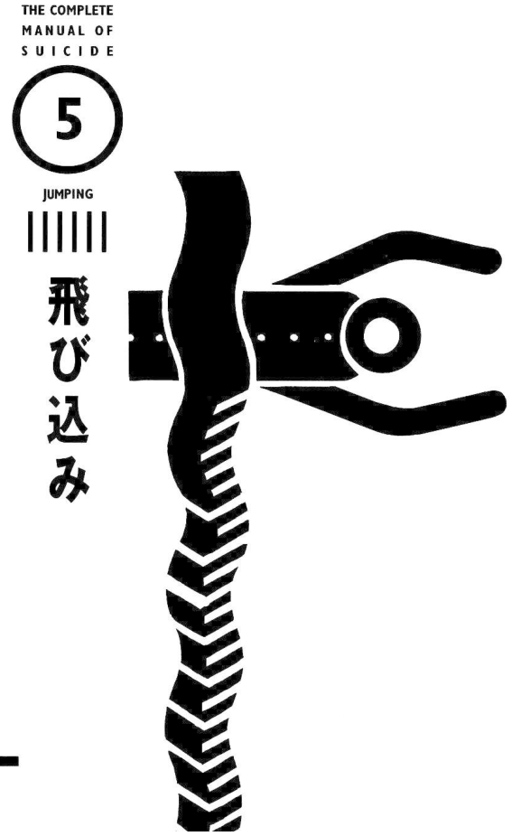

# 5. By vehicle

| | |
| --- | --- |
| Pain | ▼▼▼▽▽ |
| Trouble | ▼▽▽▽▽ |
| Ugliness | ▼▼▼▼▼ |
| Ripple | ▼▼▼▼▼ |
| Impact | ▼▼▼▼▽ |
| Lethality | ▼▼▼▼▼ |

The corpses will be bruised and bloody; the suspension of electric trains will cause great obstruction. However, this method can indeed lead to death when one is determined to die, so it is becoming more and more popular.

Dragging an extremely tired body out of the company or school, just thinking about tomorrow makes you feel extremely heavy. At this time, you stood on the platform and heard the announcement that the train was arriving. "I don't want to think about the future anymore, I really want to be a ghost-under-the-wheel[^wheel-ghost] here and end everything..." There must be many people who have such thoughts in their minds. Although people knew that their miserable corpses would be exposed in front of people, people who died after crashing into trains kept appearing. Perhaps this method was perfect for the impulsive desire to commit suicide.

[^wheel-ghost]: In Japanese and Chinese mythology, there are many kinds of possible wandering ghosts. Typically, for each possible way of dying in the inappropriate way -- that is, any way of dying that is not a peaceful old-age death surrounded by friends and family -- there is a class of wandering ghost for that. For example, hanged people become hanging ghosts with long tongues and bulging eyes. Starved people become hungry ghosts who try to eat anything they can get. People killed in battles become warrior ghosts who wear trash-heap armors and try to ambush people walking alone in the wilderness. Etc. The "ghost under the wheel" is a modern class, invented after cars and trains became common, although even back in ancient history, a few people did die under the wheels of carts.

When it comes to suicide by vehicle, the easiest one is railway suicide, followed by hitting a truck on the road. However, according to statistics from the Metropolitan Police Department in 1991, 179 people committed suicide on tracks inside stations, and 78 people on railway tracks not inside stations. There were only four suicides by cars on the road. In other words, except for jumping into the sea or lake, more than 99% of the accidents did not hit ordinary vehicles but hit trains and trains. Among them, most of them lie on the railway track outside instead of inside the station.

There are more people lying on railway tracks than ordinary car crashes. This may be because this method has a high death rate. It is a sure-fire method like hanging or jumping off a building. If you want to crash and die, then hit the train without hesitation!

According to statistics from the former National Railways Metropolitan Area Headquarters, the months with the most people lying on railway tracks are July and August, between 6 and 7 o'clock in the evening, which is slightly different from statistics on other suicide methods. Men account for 77% of the gender. Another interesting thing is that more people commit suicide on cloudy days.

## Preparation

### Wait at the station where the express train passes

When jumping off the platform at a station, choose a "non-stop" option for limited express or direct express trains. The fatality rate of a decelerating train will also be reduced. If it is stopping at a station, you should choose the farthest train entry point on the platform.

Jumping suddenly and unexpectedly will have an impact on those around you. Although it is not bad, if the timing is too late, it will hit the front of the car and be bounced off, possibly surviving. If the force of the jump is too strong, you may overshoot and flop onto the other side of the track.

There is no need to fumble it with anxiety. When the train entering the station is more than 100 meters in front of you, even if it brakes immediately, it is too late. The train would have been already braking as it is entering the station, so the emergency brake wouldn't help. Probably they will not stop you if you calmly jump onto the track and lie there. A 42-year-old company employee came down from the platform to the track and lay prone there waiting for the arrival of the tram. Finally, the train ran over him, crushing his head and right leg, and he died on the spot.

A Yamanote Line train entered Tokyo Station at a speed of 57 km/h. It braked suddenly because a man jumped off the track 30 meters in front of it. However, due to inertia, it still drove forward for more than 100 meters, and the man was crushed. It was broken into pieces, and the brain matter burst out from the back of his head. He died on the spot. At this time, you should remember that the train siren will be so loud that it will almost deafen your ears.

### Act at night

When lying on the track some distance away from the station, try to choose a spot that is behind a sudden bend, so that it is hidden from the driver. It's also a good idea to take a train beforehand and observe areas at the front of the train that the driver doesn't pay much attention to. Once you find a suitable place, you can lie down on the track and wait for the train. However, you will hear a rumbling roar when the train approaches. It is said that in this situation, you would panic and cannot stay put, not if you are a normal mental state, so it is best to take some alcohol, sleeping pills, sedatives, etc. However, there was also a third-year high school female student who was run over by the train when she jumped from the uplink platform of Shizuoka Station to the track and stood still facing the "Hikari" train[^hikari] traveling at a speed of 200 km/h. This is truly an example of courage that makes people want to bow down in respect.

[^hikari]: Hikari (ひかり, "Light") is the name of a high-speed train service running on the Tōkaidō and San'yō Shinkansen "bullet train" lines in Japan.

It is also more difficult for trains to stop on ordinary routes. A train traveling at a speed of 90 km/h braked suddenly when it found a figure 200 meters ahead. However, the train stopped where it ran over the person and then traveled another 200 meters. According to the data, the distance until the train stops after emergency braking is `s^2/20 + s/2`, where `s` is the speed at the time of breaking.[^formula-problem]

[^formula-problem]: This formula is given without units in the original Japanese. I cannot figure out what it is supposed to be, though the most likely inference is that `s` is in km/h, and the result is in meters. This would at least be consistent with the example given in the paragraph: for the train traveling at 90 km/h, applying the formula gives a breaking distance of `90^2/20 + 90 / 2 = 450` meters, which matches the actual breaking distance of 400 meters given in the paragraph.

In terms of time, you should definitely choose night time. Neither the people around nor the driver would notice you easily.

If you have difficulty entering the rail track area, you can either quickly run in from the level crossing, or jump from the pedestrian bridge. There are many cases of jumping from the level crossing. There are actually many ways to enter the track area. (See Case study 16)

### Instant certain death

If you lie down on the track from the beginning, any part of your head, abdomen, chest, hands and feet lying on the track will be crushed. As long as the chest and head are crushed, you will die on the spot. If the clothes are caught by a vehicle, they will be dragged up for more than ten meters, and then the body will roll multiple times and various parts will be run over multiple times. The crushed corpses will be scattered for hundreds of meters. This will most likely happen when jumping from a platform or breaking in from a level crossing.

The kinetic energy of the train is so great that sometimes shoes or bags will hit people on the platform, which indicates that the person is dead. A man flew into a train traveling at 85 km/h. As a result, his hands, legs, and body were crushed to pieces and scattered within a hundred meters. His head was missing.

Being crushed by a Shinkansen train was even worse, as if the body had been stirred by a blender. Near Sagamino plateau, a man suddenly squatted on the track 300 meters in front of the "Hikari" train traveling at 200 kilometers per hour, with his back to the train. A cloud of dust. Blood splattering everywhere. Scattered within 400 -- 500 meters were his mostly intact liver, parts of the scalp and hair, about 30 cm of the spine connected to the pelvis, a bit of skin from the neck and jaw, the right wrist, three teeth, etc. The other parts became pieces of meat and bones scattered farther away. After braking, the train traveled forward for three or four kilometers before stopping.

### Red mist falls like rain

The aforementioned girl, who was standing on the track, was hit by the "Hikari" train. Her upper body hit the platform wall 30 meters away and then bounced back to the platform. Then her clothes and sunglasses also flew towards the same place. A bloody mist appeared. The sales department on the descending platform said that they only heard a dull and loud bang, and their eyes suddenly turned red. So, what is the force that causes body fragments or items to be ejected with such violence?

If the body collides with the front of an ordinary train, it will be ejected five to six meters if the train is moving. At this time, there are many cases of death due to instantaneous cardiac arrest. In this case, if you still fall on the track after being ejected, your body will be crushed. But if you fall outside the track, unfortunately, you can still survive.

## Corpse appearance: Flesh and blood flying everywhere

This is the most brutal-looking of all suicide methods, and you should be mentally prepared for it. However, unless the crash is at a station or a level crossing, the body will not be seen by ordinary passengers and onlookers. Sometimes the bodies that were knocked out showed no damage on the surface. In this case, the damage to the internal organs is severe.

The station staff usually disposes the body and cleans up the surroundings in about ten minutes, but after thirty minutes they might still have not found the crushed hands or neck. A man who committed suicide had his face attached to a truck and was discovered after traveling 900 km from Fukushima Prefecture to Hokkaido. There is also an example where the arm of a woman who was hit in Yamaguchi Prefecture was discovered after traveling 900 km to Yokohama.

Although the bodies were removed and the trains resumed running, bits and pieces were scattered everywhere, and the sleepers and paving roads were still stained with blood, leaving tragic traces. If someone is crushed to death by lying on the track outside the station area, it is less likely that the body will be left crushed into two or three pieces. In short, this is definitely not a suitable method for people who want to die as a connected piece of meat.

## Note

### The track and the body should be at right angles

You may get unlucky, and your hands and feet are crushed but not fatally, and you may have to rely on prosthetics for the rest of your life (Case study 15). To avoid this, let your neck or chest lie on the track. Sometimes the body would get caught in the middle of the track and miraculously you would only scratch the skin a little (Case study 14). Therefore, making the body and the rails cross at right angles is the basic method of suicide on rails.

### Be prepared to pay huge compensation

Railway suicides can result in huge compensation bills. According to statistics from the old National Railways in 1985, an emergency braking of a train will cause 6,000 to 8,000 yen in power loss and about 10,000 yen in wheel wear costs. If a train stops once, for Tokyo's Yamanote Line, which has a large number of passengers, hundreds of thousands of yen will be lost every 15 to 30 minutes. During peak hours, it will cause losses of 1 to 2 million yen. The damage cost of the Shinkansen is even greater, tens of millions of yen for one hour of delay. In addition, there are fees for housing the deceased. There is also an example of a car crashing into a limited express train and being asked for 30 million yen in compensation, and an example of a car crashing into a Tokaido line and being asked for 140 million yen in compensation. People who know the inside story said that the railway companies typically do not claim compensation for the sake of public opinion. But Japan Railways is not a nice guy. Although they might not file a legal case, they might still attempt to get some financial compensation. However, there are many cases where the contact address of the deceased's family members is unclear, and so they cannot obtain compensation.

From this point of view, committing suicide by lying on the train is not a cost-effective method. Still, as mentioned at the beginning, when you suddenly wants to die, this is the method that appears ready-made in front of you. If you want to die without waiting, it is of course the best solution for such impatient people. Render unto Caesar the things that are Caesar's, and unto the future the troubles that are the future's.

## Case study 14: Ms. OL, who miraculously survived under a train

At around 5 p.m. on December 29, 1991, a 24-year-old woman, OL, attempted suicide by jumping onto a moving train on the Musashino Line from an overpass 500 meters in front of Nishi-Funabashi Station. She was a single woman, working at a computer company in Chiba City, and she was on her way home from get off work at the time. The overpass is 7 meters high. If she had fallen in just the right posture, she would have died even if there was no train passing. She jumped onto the track when the train was 10 meters away from her. Then the train passed by, and the driver also felt, "She's crushed!" The train braked immediately and stopped. She was under the 6th carriage, counting backwards from the last one. Her body happened to be sandwiched between two rails and she was not injured. The doctor diagnosed her with contusions on the head and waist that required treatment for a week. She was saved because she had a small body, her back was not hooked by the vehicle, and the train slowed down before it entered the station. Otherwise, the body will be roped into the wheels and she would be crushed to death.

Although she did not say the motive for committing suicide, her friends said that it was related to her recent relationship troubles with a man.

### Check: this example

Jumping off a building and crashing into a car, this is a rare example of using two highly lethal means at the same time, but still surviving. Usually, even a person who jumped from a height of 7 meters would suffer serious injuries. In addition, the train passed on top, but in the end, she only suffered minor contusions. This is indeed a miracle. It is another miracle that she did not plan to sandwich the body in the middle of the rails beforehand, but did so accidentally. Wasn't there a female suicide, popularly called a "Human Bullet"[^nikudan], who also jumped from an overpass towards a train? She smashed the front panel of the cab,, fell inside the cab, and died there.

[^nikudan]:
    In 1932, three Japanese soldiers died in battle during the Shanghai Incident. Sensational newspaper reports lauded them as suicide bombers who crippled the defence of an enemy stronghold with only a Bangalore torpedo and "pieces of torn flesh". Hero worship and commercialization followed shortly thereafter. Their alleged exploits inspired books, movies, theatrical performances, political speeches, radio dramas, and popular music. They were called the Nikudan-san'yūshi (Three Heroic Human Bullets). Here, the word "nikudan" means "meat bullet", to invoke the mental imagery of humans rushing forward like bullets, without fear and without desire to return. It is a Japanese term for suicidal charge.

    Similarly, in China, there were Chinese equivalents of nikudan. For example, Dong Cunrui was a Chinese Communist soldier during the Chinese Civil War. Legend has it that during a battle, he reached a bunker, but he could not reach a place to effectively place the explosives. Shouting "For a new China!", he pressed the explosive against a point on the bunker, then detonated it, breaching the bunker.

There is a question worth thinking about, that is the day and time when she decided to commit suicide. December 29, 1991 is Sunday. The work was supposed to end the day before or two days ago, so why did she stay in the company until after five o'clock in the evening? What was she doing?

Regardless, she was determined to commit suicide. However, because of this unexpected situation, it is difficult to say that suicide will definitely be successful if this is done.

## Case study 15: A woman who survived a railway suicide attempt, losing one hand and two feet

In February 1955, Ms. T attempted suicide by crashing her car, but failed. She was a 16-year-old grade-11 high school student at the time. At about ten o'clock in the evening, she rushed to the express train that had just departed from Shinjuku Station on the Odakyu Line, and "jumped off as if she was attracted by the railway" from the front of the platform. The train braked suddenly and stopped. T's right ankle, the part below the knee of his left foot, 15 cm below the shoulder of his left hand, and the ring finger and little finger of his right hand were all broken. All that is left are the thumb, index finger and middle finger of the left hand. At that time, T screamed desperately: "It's hot, it's hot!" and soon lost consciousness. She was taken to the hospital by ambulance and was in a coma for a week. When she regained consciousness and learned of her condition, it was the tenth day after the accident. T once thought in despair: "I have no choice but to die again." Later, she believed in the words of a Christian pastor and the Bible and decided to live on. She was discharged from the hospital in August and both legs were fitted with prosthetics. She married the pastor the next year, had two children, and is now engaged in speaking engagements promoting the preciousness of life.

### Check: this example

It was her fault to collide with the train that had just started from the front of the platform, but it was probably just an accident that her neck, body and other parts that could have been fatally injured were not crushed. However, this example also shows that the faster the train, the better. However, even a train that has just started has the power to break hands and feet. This is a rare example of failed railway suicide.

## Case study 16: Woman crushed to death in Seikan Tunnel

In March 1991, the body of a 26-year-old woman was discovered near the Yoshioka-Kaitei Station in the Seikan Tunnel under the Tsugaru Strait that separates Honshu and Hokkaido. Both hands and legs were completely cut off above the forehead. However, Yoshioka-Kaitei Station is a disaster backup station among the two unmanned stations in the Seikan Tunnel, which is located on the side of the tunnel. The trains do not stop there, so it is not a place that ordinary people can walk into at will. How could she die in such a place?

Investigation results showed that this woman had been missing since the day before yesterday. She decided to return home to Tokyo on the 18th, and the incident occurred on her way home from Sapporo. She had suffered a nervous breakdown not long ago, and she had made up her mind to die. She took the express train that departed at 22:00 on the same day. When she passed Yoshioka-Kaitei Station at about 3:50 the next day, she climbed up while the train was slowing down. After entering the driver's room, he opened the window and jumped out. Then she lay down on the railroad track on the other side and was crushed to death by a truck passing by around four o'clock.

On the same day (18th), she called home and told her father, "I'm going home soon."

### Check: the cause of death

Lying on the tracks and waiting to die is very difficult, especially in an urban area. But the "tunnel suicide" she invented can be used in urban areas. Going around to find the blindspots in the city is also fun in preparing for railway suicide. It seems that the subway also has many blindspot places.

The main condition for walking within the driving route is that the surroundings must be dark. Don't let others see you when entering a level crossing in an urban area. This is more likely at night and difficult for drivers to spot. In fact, the female corpse was only discovered an hour and a half later, around 05:40, which means the driver was completely unaware of it.

It is also important to cut off completely above the forehead. You can imagine the huge cutting power of train wheels. It was assumed that she was lying on the tracks, based on the condition of the body. If you leap in front of a car, you will most likely be crushed to bits. If you lie straight on your back, you will be cut cleanly into segments. This is a great inspiration for those who attempt to commit suicide by lying on the train tracks somewhere other than at the station.

In the plot of Nishimura Kyotaro's mystery novel *Seikan Murder Express Train Route* (青函特急殺人ルート), there is a female corpse found at Yoshioka-Kaitei Station. Maybe she has read this novel.

Having said that, it is unimaginable to be able to lie on the rails and wait for more than ten minutes in the biting cold darkness on the seabed 150 meters below the ground. It is unimaginable for ordinary people to have an extremely terrifying experience that exceeds ordinary fears. The psychology before suicide is really hard to understand.
