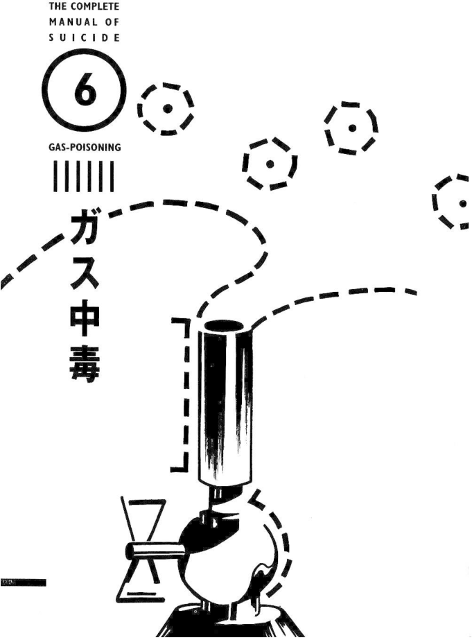
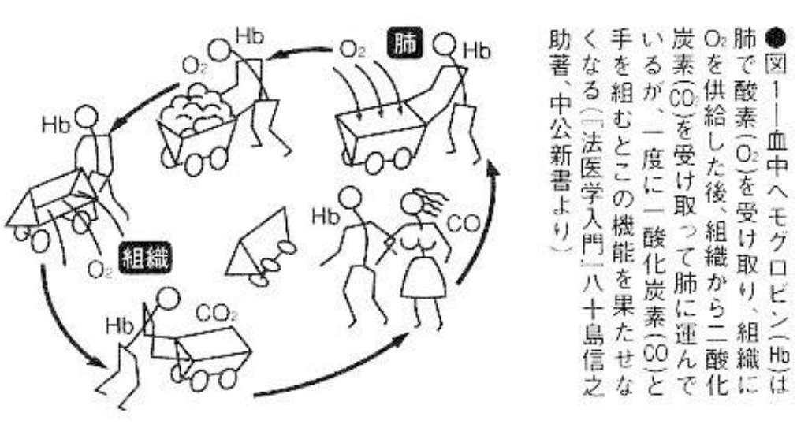
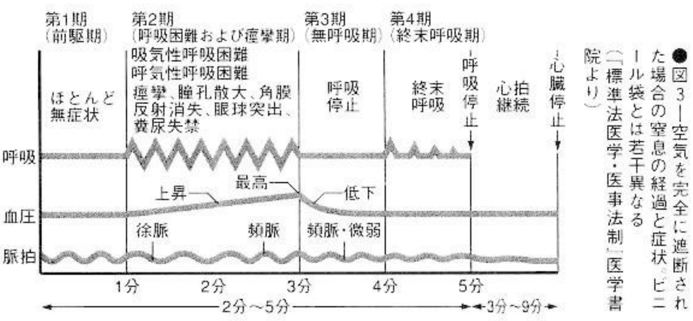

# 6. Gas-Poisoning

## (1) Gas poisoning in the car

| | |
| --- | --- |
| Pain | ▼▼▽▽▽ |
| Trouble | ▼▼▼▼▼ |
| Death state | ▼▽▽▽▽ |
| Implicated | ▼▽▽▽▽ |
| Impact | ▼▽▽▽▽ |
| Lethality | ▼▼▼▽▽ |

Connect a pipe from the car's exhaust outlet to the car window and block the gap. It is quite time-consuming and laborious, but it can lead to an easy death and the death is not too ugly.

To avoid making mistakes, I want to make it clear that it is impossible to die so happily if you rely on city gas. Turning on the gas switch in a room, then collapsing and drifting into unconsciousness... is a thing of the past. Today's city gas, because the gas company has changed the gas of the past to natural gas that does not contain carbon monoxide that causes poisoning, poisoning deaths will not occur except in some areas. Liquefied gas also does not contain carbon monoxide. Even if you died, it would just be due to suffocation due to lack of oxygen. The pain felt by death by poisoning and death by lack of oxygen are completely different. Generally speaking, death by poisoning is a relatively comfortable way to die. Gone are the happy 1970s when you could easily poison yourself in your room. However, car exhaust containing carbon monoxide is still deadly. In fact, most of today's "gas suicides" have been replaced by this exhaust gas.

If you want to use gas or propane gas, you have to be prepared to endure pain that is worse than death. You can suck the gas pipe with your mouth, fill the small room with gas, and eventually die from lack of oxygen. If you are lucky, like the 17-year-old girl, you will suffocate to death the moment the tube is opened. Having said that, some homes are equipped with safety devices that automatically stop discharging after a few hours after a large amount of gas is emitted, and there is also the risk of explosion. Therefore, it is best not to consider gas suicide at home.

If you want to die from lack of oxygen, there is no need to fill the room with gas, just cover your head with a plastic bag. Although it seems a bit primitive, more than a hundred people commit suicide every year using this method. In addition to plastic bags, the effect will be better if other methods such as drugs are used to commit suicide at the same time (Case study 19).

Similarly, although people did not die from poisoning, there were also people who filled the room with gas and set it on fire. This method is simple and suitable for people who commit suicide impulsively. However, although bombing has the effect of killing someone on the spot, in fact there are many cases of people being burned all over their bodies and suffering pain for several days before dying again. This causes great harm to the surroundings, and there is no guarantee whether it will be completed smoothly. Sometimes it will only cause a fire. That's all, so it's not worth recommending.

### Preparation: Fill the fuel tank with gasoline

To commit suicide in a car, you must first prepare a three to four meter long rubber tube and tape. The rubber hose should be purchased at the grocery store according to the thickness of the exhaust port. If the thickness is wrong, you can wrap it with a few more layers of tape so that it will neither leak nor fall off. Then connect the rubber tube to the exhaust port and secure it firmly with tape. Then insert the rubber tube through the window and seal the window seam tightly with tape. In this way, the interior of the car becomes sealed. You sit in it, close the door, start the engine, put down the seat, listen to the music played by the speakers in the car, and slowly drift towards permanent sleep.

Be sure to fill up the tank with gas. If your neighbors aren't paying attention, you can park your car in your own garage, but it's better to park it in a forest where people can't see it. It's also an excellent place to park your car in an out-of-season vacation spot because no one would be snooping around. Or cover it with a car cover so that no one will notice the indicator light of the stereo even if you are listening to music.

When committing suicide in a room, first confirm whether the gas used contains carbon monoxide, and also check whether there is a safety device. The only thing left is to seal the window cracks tightly, whether you die of carbon monoxide poisoning or lack of oxygen, put more tape on the window cracks and door cracks, and when you are ready, turn on the switch and go to sleep.

If you use propane to commit suicide, because propane is heavier than air, you must lie down on the floor. On the contrary, gas is lighter than air, so it is better to use it as high as possible. If you have the courage to put a rubber tube in your mouth, that would be great. Surprisingly, many people use this cutting-off technique. Kawabata Yasunari[^yasunari], also committed suicide in this way. There are also examples of people who died by stuffing their heads into a gas stove.

[^yasunari]: 
    Japanese novelist and short story writer whose spare, lyrical, subtly shaded prose works won him the Nobel Prize in Literature in 1968, the first Japanese author to receive the award.
    
    Kawabata apparently committed suicide in 1972 by gassing himself, but a number of close associates and friends, including his widow, consider his death to have been accidental. One thesis, as advanced by Donald Richie, was that he mistakenly unplugged the gas tap while preparing a bath. Many theories have been advanced as to his potential reasons for killing himself, among them poor health (the discovery that he had Parkinson's disease), a possible illicit love affair, or the shock caused by the suicide of his friend Yukio Mishima in 1970.

The method of covering the head with a plastic bag is foolproof as long as it does not leak. It is also good to tie a rope around the neck.

### Note: Beware of explosions

When committing suicide in a car, carbon monoxide is lighter than air, so the gas sometimes leaks out through the window cracks. If you are discovered during this period, or you may run out of gasoline, I advise you to seal the window cracks tightly. Although death from poisoning is less painful, headaches and nausea will persist if you do not lose consciousness for a long time, so it is better to take sleeping pills at the same time.

The man introduced the gas into the car, blocked the window cracks, blocked the front window with a blanket so that no one could see inside, and then took 60 sleeping pills. He was still awake and alerted the police when he was discovered. Although he shouted "It's within my rights to die!", he was still forcibly pulled out of the car. Not all forms of suicide is a slow descent into unconsciousness.

When filling a room with gas, special attention must be paid to explosions. Even the flash of a fluorescent lamp pointer can cause an explosion. If a big explosion occurs, a huge amount of compensation will have to be paid, and there are many cases where people are surrounded by gas but do not die (Case study 18). Just like some people who first put up a note "Turn off the gas switch, open the doors and windows to release the gas, do not use electrical switches and matches due to the risk of explosion" to make others pay attention, and then commit suicide by gas, you must pay attention to the possibility of explosions.

When committing suicide with carbon monoxide poisoning in an apartment, also be aware of those living upstairs. In 1976, a 20-year-old woman committed suicide by burning gas in her apartment. She did not die, but a 21-year-old woman who was sleeping upstairs died of carbon monoxide poisoning. This is because carbon monoxide is lighter than air. However, the family members of the deceased pursued the management responsibility of the suicide attempter's parents, apartment landlord, police and firefighting unit, and sued the court for 20.37 million yen in compensation. Indoor gas suicide should be recognized as the easiest way to cause trouble to other people.

If rescued, suicide by carbon monoxide poisoning, like hanging, will damage the brain's nerve tissue due to lack of oxygen, which may leave serious sequelae for life. However, the often said phrase "leaving serious lifelong sequelae" is not limited to gas suicides. Hanging, jumping off a building, crashing a car, using drugs, etc., all suicide methods are the same in this. If you want to commit suicide, you must think of the consequences of failure.

## (2) Committing suicide by burning charcoal

Prepare some charcoal and fire, seal yourself in a small space, light the flame, watch the charcoal flame burn a little and then weaken, gradually lose consciousness and then die. Although it is a bit troublesome, the death is beautiful and easy. This suicide method is mentioned in the novel *Le Juif Errant* (1844), written by the French novelist Eugène Sue, so it is possible that people have committed suicide by this method ever since charcoal was used by humans. The principle of suicide by burning charcoal is the same as that of car gas poisoning mentioned above.

Charcoal-burning suicide is widely spread in Hong Kong, and has spread to mainland China, Taiwan, Japan and other places with the Internet. While the composition of gas and other substances has changed and is unsuitable for suicide, and other suicide methods are difficult to implement, charcoal-burning suicide can be regarded as a simple substitute.

### Preparation Find a small and easily enclosed environment, sufficient charcoal, firestarter, and tape

Most people who commit suicide by burning charcoal choose to commit suicide in a single room at home or in a hotel, and the bathroom is favored because of its small size. Generally speaking, there is relatively less oxygen in a small space, and the carbon monoxide concentration will reach lethal concentrations faster when burning charcoal. Generally speaking, bathrooms, carriages and other places with an area less than 6m2 are very suitable, but wooden structures should be avoided as much as possible. On the one hand, wooden structures have more gaps than concrete that are difficult to seal, and wooden structures also increase the risk of fire.

Fire and charcoal should be the easiest to obtain among various suicide tools. Generally speaking, machine-made charcoal and barbecue charcoal are the best choices. They can be purchased in major shopping malls such as Walmart. If you can't find it, just go to the shops and ask for barbecue equipment. For starting the fire, you can choose from disposable lighters, matches, etc., but you may also need some paper, gasoline or other things to light the charcoal.

Tape is used to seal the environment, but you can also use other things for sealing. Close the doors and windows, and seal all door and window gaps with tape. In the bathroom, be sure to block the exhaust fan opening, and even the gap of the sewer drain, and all cracks in the ceiling.

If possible, taking some alcohol or sleeping pills to put you to sleep can help combat the pain of inhaling carbon monoxide.

Next, prepare the charcoal you bought, use your finally courage to light it, and sit quietly and wait for death to come.

### Note: Fire prevention, keep a sitting posture

Since you are lighting a fire to burn charcoal, there is bound to be a risk of fire. If you are afraid of harming others, clear the surrounding flammable materials before lighting a fire. Laying a flame-retardant blanket on the ground or using a barbecue grill to burn charcoal are also feasible methods.

Because carbon monoxide is less dense than air, carbon monoxide in the air will tend to float upward. Only by staying seated can you ensure that you inhale enough carbon monoxide.

### Experience: Very little pain

As the concentration of carbon monoxide in the air increases, breathing rhythm slows, dizziness and heartbeat increase, and soon the person loses consciousness and dies. This is because hemoglobin, which transports oxygen in the blood, combines with carbon monoxide at a strength two hundred or even three hundred times that of oxygen, forming CO-bound hemoglobin, which drastically reduces the oxygen supply to cells in the body. When the concentration of carbon monoxide in the air reaches 35 ppm, it will cause harm to the body.

The concentration of carbon monoxide contained in car exhaust is about 0.4 to 0.5%. When the proportion of CO-bound hemoglobin in the blood reaches 30%, you will first feel dizziness, headache, collapse, fatigue, and reduced judgment. When it reaches 40%, you will feel nauseous, unable to do what you want to do, and feel tired. When it reaches 50%, the skin turns red due to carbon monoxide and hemoglobin, and the body temperature drops. When reaching 60%, shortness of breath, absence of consciousness, incontinence, and convulsions may occur. When reaching 70%, breathing stops and death occurs quickly (see Figure 2). A person who commits suicide by poisoning in a car will fall unconscious in about half an hour to an hour.

### For "the most beautiful suicide", avoid incontinence

Among all the corpses of suicides, people say that the corpses of gas suicides are "the most beautiful." Your body will be found stained pink because blood containing hemoglobin carbon monoxide gives the skin a pink color. Clothes may become untied during cramps, but that's okay. However, incontinence often occurs in gas suicides. In the home of a man who died from carbon monoxide poisoning in the bathroom, there was faeces in the kitchen and on the bed. Since there was no feces in the deceased's rectum, we knew it was his. At that time, carbon monoxide was accidentally produced by heating the bath water when there was no bath water. He could not hold it in the kitchen or the bed, and then he went to the bathroom and died. Generally, incontinence occurs even when someone is conscious. Anyone who wants to see a clean body must go to the toilet beforehand.

## Case study 18: Man sentenced for gas suicide attempt

In April 1978, a 47-year-old unemployed man who lived in a townhouse in Fukuoka Prefecture attempted to commit suicide by using gas. At around 10 a.m., he fell into hallucinatory symptoms of stimulant poisoning. He was distressed because his mistress had left and thought of committing suicide. He pulled a rubber hose from a propane barrel outside the house to the bathroom, filling the room with gas. But he didn't die after a long time. Two hours later, when he wanted to smoke and lit a lighter, the gas exploded. The explosion caused a total of 12.4 million yen in damage to the 28 households living in the town house, and injured nine residents. He himself was hospitalized for a month to treat burns.

He was charged with the crime of "gas leakage", and in February of the following year, the Iizuka Branch of the Fukuoka District Court sentenced him to 8 months in prison for the crime of "injuring multiple people and causing serious consequences."

### Check: this example

This is an example of someone who chooses to commit suicide by using a gas explosion, but since the attempt failed and caused damage to the surrounding area, he was be charged with the crime of "gas leakage".

Article 118, Paragraph 1 of the Japanese Criminal Code stipulates: “Anyone who causes danger to human life, body or property by leaking or flowing out or blocking gas, electricity or steam shall be sentenced to imprisonment of not more than three years and a fine of not more than 100,000 yen fine."

A similar example is that in 1976, a 28-year-old company manager in an apartment in Osaka also attempted suicide by using gas indoors, resulting in a big explosion. One apartment was burned down and about 70 others were injured. He prosecuted for the crime of "gas leakage" and "fire from gross negligence". Even if he is a suicide attempter, he cannot escape legal responsibility.

From the above examples, we can also know that the propane explosion that filled the house for two hours may not have killed anyone, yet it damaged to 28 households, and yet he only suffered injuries that required treatment for a month. The contrast between the lack of personal death and the great property damage is curious.

When the room was full of gas and he was about to die, he lit the lighter because he wanted to smoke. It seemed that he was a fool, but in fact there were many such ridiculous things in this world.

## Case study 19: A man who committed suicide according to a French suicide manual

In July 1983, a strange man (46 years old at the time) wearing swimming trunks and immersed in the cold water of the bathtub, with a black plastic garbage bag on his head and a rope around his neck tied to the window sill. The body was discovered. Empty bags containing 40 tablets of the analgesic "SEDES" were found in the apartment where he died. It seems that he took the medicine and then committed suicide in this way. At the same time, I also found the instruction manual "Suicide - the most comfortable ways to die" published in Japan in the same year in the room[^suicide-mode-demploi], and clipped a tape to the reference page. On page 184, four combinations of suicide methods that can lead to euthanasia are introduced: "1. Suffocation with analgesics and plastic bags; 2. Poisoning caused by large amounts of drugs that can reach poisoning levels and car exhaust gases ; 3. Analgesics and hypothermia (long-term immersion in cold water); 4. Analgesics and drowning." He committed suicide by choosing a combination of one and three.

[^suicide-mode-demploi]: 『自殺―もっとも安楽に死ねる方法』 (ISBN 4-1934-2696-3), published by Tokuma Shoten Publishing Co., Ltd (徳間書店) in April, 1983. It was a translation by Kunio Igarashi, of *Suicide, mode d'emploi, sous-titré Histoire, technique, actualité* (ISBN 2-85209-000-7), a French book by Claude Guillon and Yves Le Bonniec, published in 1982.

He was a salesman at Korakuen Stadium, the predecessor of Tokyo Indoor Stadium. He disappeared a year ago. Later, he left his wife and children and lived as an alcoholic man in a small room. The reason for his disappearance is said to be that he ran away after being chased by his creditors after being in debt.

### Check: the cause of death

Suicide by suffocation with a plastic bag is painful, but very simple like this. The analgesic "SEDES"[^sedes] cannot reach a lethal dose, but the effect of the drug and the hypothermia caused by cold water are useful in reducing the respiratory function.

[^sedes]: SEDES (セデス) is a general-use analgesic and antipyretic drug sold by the Shionogi Pharmaceutical. The name is derived from the English word "sedative," and the name was given the palindromic spelling "SEDES" because it was easy to read and memorable.

The role of suicide manuals cannot be ignored. The original book was published in France in 1982. Soon six people were affected and committed suicide. Therefore, it caused a great response and became a best-selling manual. The part this person refers to comes from the manual issued by the "British Euthanasia Association" on membership restrictions, so the description is correct. Needless to say, this book also draws on some material from that book.

What’s interesting is that he specifically put a tape on so that others could understand that he was “going to die after watching this.” There are also people in France who committed suicide by taking poison after opening the pages of the reference book. The intention of trying to attract the attention of the world through this method is very clear.

## Case study 20: The rōnin student[^ronin-student] who used a plastic bag to conduct a suicide experiment

[^ronin-student]: In contemporary Japanese slang, a rōnin (浪人) is a student who has graduated from middle school or high school but has failed to achieve admission to a desired school or even any school at the next level, and consequently is studying outside of the school system for admission in the next year.

In November 1974, an 18-year-old man was found in Kawasaki City. He had suffocated to death in bed with a plastic bag covering his nose and mouth, and then with a rubber band. There are two pieces of 400-word manuscript paper on the desk, which contain the results of testing various suicide methods, with the title "Under Experiment". It can be seen from this that the young man put a plastic bag over his mouth and suffocated to death during a suicide experiment.

His notes are as follows: "(1) 15 minutes after the experiment started, breathing accelerated and hands and feet were numb. 25 minutes later, the whole body was paralyzed, breathing tripled, and heartbeat 120 times. You can survive for 30 minutes if you stay still in bed. (2) Brain disorder occurs in about one hour, and death occurs in about two hours. Before that, the plastic bag should be removed and the heart should be massaged."

### Check: the cause of death

It seems that someone who commits suicide with a plastic bag goes through the sequence of "suffocation -> numbness of hands and feet -> general paralysis -> rapid heartbeat -> loss of consciousness" and so on until death. So, why didn't he take off the plastic bag? The possible reasons are: (1) When he was about to suffocate, he hurriedly wanted to take it off, but in his hurry, he unexpectedly fell unconscious quickly. (2) As he slowly loses consciousness, his body becomes paralyzed, and he could not take it off.

If item (2) is correct, then though we have always written that suicide by suffocation is painful, but in fact it might be a quite comfortable method. However, this feeling about dying cannot be tested and can only be known by doctors' speculation. Therefore, these "death experiments" are also extremely valuable information in medicine.
