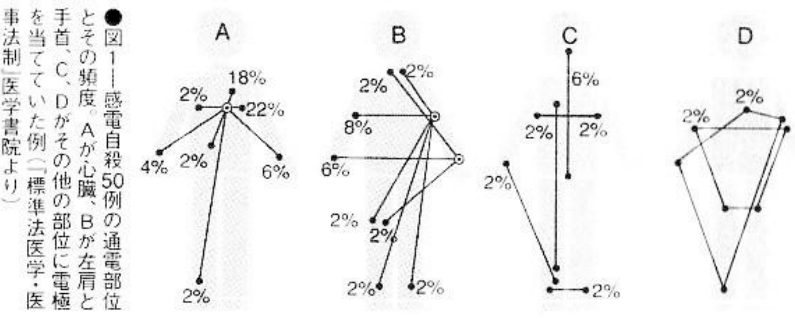

# 7. Electrocuting

| | |
| --- | --- |
| Pain | ▼▼▼▽▽ |
| Trouble | ▼▼▼▼▽ |
| Death state | ▼▽▽▽▽ |
| Implicated | ▼▽▽▽▽ |
| Impact | ▼▽▽▽▽ |
| Lethality | ▼▽▽▽▽ |

Gentler than generally imagined. The disadvantages are: a few seconds of electric shock, and the trouble of stripping the skin off the wires.

Statistics from Japan's Ministry of Health and Welfare in 1991 show that among the 19,875 suicides that year, 56 used electrocution, which was the least popular method of suicide. Moreover, the strange thing is that 53 of them were men, accounting for 95% of the total. It can be said that it is a suicide method used almost exclusively by men. It is not because the overall number is low. Even among the statistics of more than 100 people, more than 90% are men. Some people say that it may be because women are particularly afraid of electricity.

Death by electrocution is caused by instantaneous respiratory cessation, cardiac arrest, shock, etc. The pain is really only momentary. One doctor said that suicide by electrocution is one of the comfortable ways to die.

The method is very simple. Peel off one end of the wire to expose the copper wire, plug it in and touch it to your chest or back. For those who are impulsive and want to die, this is the best method. The disadvantage is that there are many attempts, but there are no special sequelae, so it is a good method that you may want to give it another thought.

## Preparation: Electrify the heart

Sneaking into the substation to touch the high-voltage current part is the easiest way, but it is scary after all. Or connect a wire in your house, stick the two terminals on your body, put on a timer and go to sleep. One copper wire is attached to the chest, and the other is attached to the back. If you don't want to attach it to the chest, you can attach it to both wrists. A 16-year-old female high school student committed suicide by wrapping a wire around her right thumb and sticking the other wire to her vest. But to do this, the wire should preferably be wrapped around the left thumb, which is closer to the heart. There is also a nuclear scientist who puts one end of the electrode in his mouth and inserts the other end into his anus to commit suicide using a timer. However, how he fell asleep without letting the copper wire fall out of his mouth is still a mystery. Better not imitate this.

Just tape down the copper wire. Wet the part in contact with the body, the resistance will be less, and the effect will be better. Under normal circumstances, the resistance is also a factor that reduces the accuracy. You might as well use wet absorbent cotton or gauze to hold it down from above. You can use salt water when wetting absorbent cotton. If you can get some ointment used for electrocardiograms, the resistance will be less. There are also examples of using 10-yen coins as conductors. Of course, wrapping both copper wires around the chest is the most reliable method. Regardless, the important thing is to keep the heart in the path of the electric current. Use a transformer to increase the voltage, and the lethality will be even higher.

Not many people can still sleep soundly in this situation, so drink some alcohol. Set the timer for the deepest sleeping time, about two hours after going to bed. There are many examples of setting the time at three o'clock in the morning, so this should be the reason. In short, it is most important to reduce the resistance as much as possible and increase the voltage.

Throwing a running electric heater or electric razor into the bathtub while bathing will also conduct electricity, but the reliability is extremely low. If you have to do it, then improve the conductivity by adding some salt to the hot water.

## Experience: A moment of bone-chilling pain

The biggest question here is what is the person's consciousness like at the moment when the current passes through? Using a timer, if it goes smoothly according to the predetermined plan, a hundred volts of current will pass through the body a few hours after you fall asleep. It causes the heart to contract immediately, and after a few seconds, the patient loses consciousness, stops blood circulation in the heart, and dies. According to a doctor's observation: Under normal conditions, there will be instant bone-chilling pain. Muscle relaxants are difficult to obtain, so you will inevitably experience muscle spasms. For example, drinking a lot of alcohol or taking sleeping pills can make you confused and confused during sleep, then die peacefully. Although one may lost consciousness at this time, one's whole body would twitch. There is another way of saying: Losing consciousness only takes a few seconds or an instant, but it takes about three minutes until the heart stops beating.

A man who regained consciousness after being electrocuted said this about the "moment": "Suddenly I felt controlled by a force and fell unconscious."

So, will it trip the wire when the current passes the body? The power company believes that "this situation is not impossible." A coroner said: "So far there doesn't seem to have been a case where a wire-trip has occurred." So, there seems to be no need to worry about this.

Since there are death row prisoners who did not die immediately after sitting on the 2,000-volt electric chair, is the 100-volt voltage in the home enough? Some people may feel uneasy. However, it's not always the case that the higher the voltage, the more lethal.

The resistance of human skin is 1000 to 2000 ohm in a dry state (women have lower impedance than men). The maximum current intensity that can pass through the body in this state is only 100 milliamps. This intensity is the smallest current that can cause ventricular fibrillation, which can stop the heart. Of course, if the skin is wet, the resistance can be reduced by one-tenth. In fact, in low-voltage situations, weak currents can easily cause ventricular fibrillation for the heart, which is actually dangerous. In addition, the most dangerous frequency to the human body is 50 to 60 Hz, which is consistent with the frequency of household current. AC power from the socket is more likely to cause ventricular fibrillation than DC power. This means that if electricity is applied to the heart within three seconds of ventricular fibrillation, a household voltage of 100 volts can completely electrocute a person.

Electrocution in a bathtub, the cause of death was cardiac arrest or shock. Applying electricity to the brain will paralyze the respiratory center and cause breathing to stop, but this is rare.

## Corpse appearance: Almost no damage

The parts touched by the electrodes will leave burn marks, but the body will be almost undamaged. The resistance of the skin is low, and sometimes there are no traces of burns. As if in a state of sleep, this is one of the methods that can leave a (relatively speaking) beautiful corpse.

## Note: Aim for the heart

The target is the heart. If you really want to die, other parts won't work. Be sure to try to get the current through the heart. If you want to use a timer to die in your sleep, don't forget to secure the copper wire firmly to prevent it from falling off in the blanket. Even if it is wrapped around your body, it will not achieve the purpose if it falls off during sleep.

Even when the person is dead, there would still be an electric current in the body. There is a risk of someone coming over to touch the body and getting an electric shock, so be careful, but there is nothing a suicide can do about this. If you don't want to cause trouble to others, then put a note saying "Don't touch, it's dangerous!"

## Case study 21: Electrocution in the restroom of a racecourse

At six o'clock in the afternoon on an April day in 1981, the body of a man about 50 years old, 160 cm tall, and with an athlete's hairstyle was found at the Nakayama Racecourse in Funabashi, two hours after the end of the last race of the day. He had connected the wire to the ventilation fan in the toilet and taped the other end to his chest. He was electrocuted and died. His body was already in rigor mortis when he was found. The deceased was wearing a new three-piece suit, a freshly starched blue straight shirt, a blue tie with white spots, a straw-yellow windbreaker, and short black leather boots. He was quite neat. He only had 8,350 yen in cash, short HOPE cigarettes, a 100-yen lighter, and a horse racing newspaper with a suicide note, but the identity of the deceased was never revealed.

He wrote a suicide note written in red pen on the newspaper: "I'm stupid. I failed in life because of horses. I'm sorry! A stupid person. I'm really sorry, I'm too tired!"

### Check: the cause of death

This is a good example of how easy it is to commit suicide by electrocution. He probably exposed the copper wire and put it on his chest, then inserted the plug into the socket and his heart was energized, causing cardiac arrest. The famous saying in the suicide note, "Life fails for the sake of horses," was used as a headline in the social section of the newspaper the next day to report the incident.
