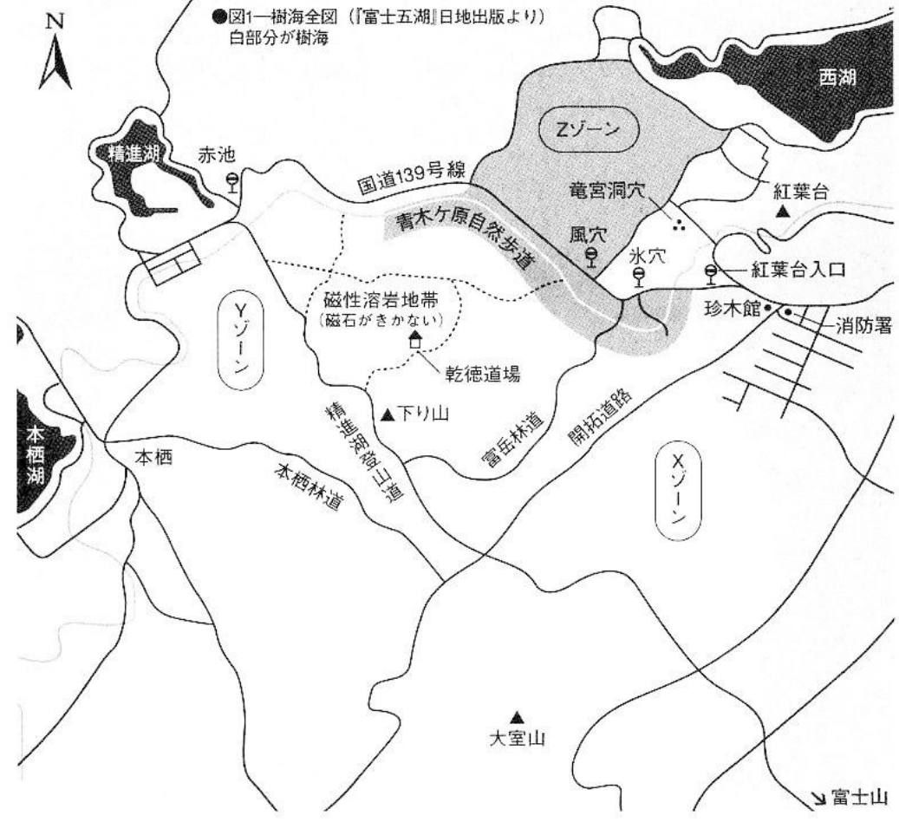
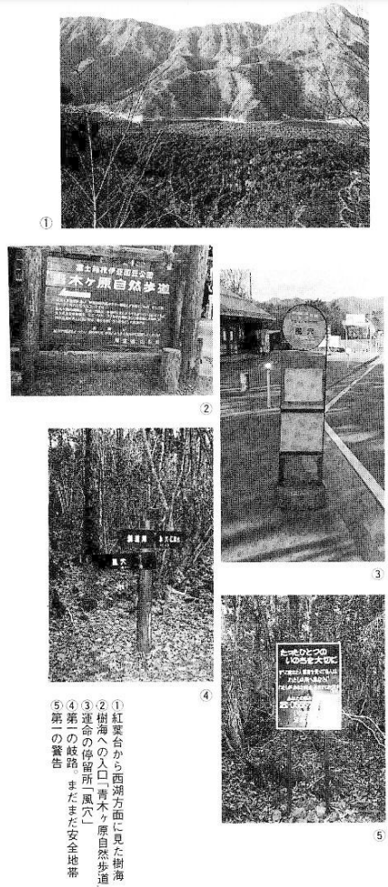
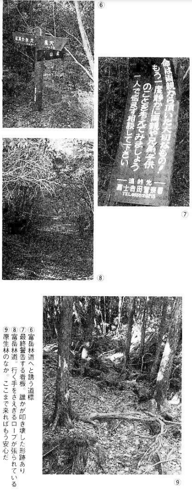

# Map 1: Aokigahara, the Sea of ​​Trees

If you are bored with your work and relationships and want to commit suicide quietly without others knowing, I advise you to step into Aokigahara, the Sea of ​​Trees without hesitation. There is no place like Aokigahara where it is easy to enter, but difficult to be found. Your whereabouts will be unknown and you will disappear from people's memory over time. However, to achieve this goal, we must study the method of entering the sea of ​​trees. This map can be used as a reference.[^aokigahara-map]

[^aokigahara-map]: The map seems rather outdated. As such, I will not carefully check the place names. Probably you can look for a better map somewhere else.

1. View the sea of ​​trees towards the West Lake from the Red Leaf Terrace (红叶台)
2. The entrance to the sea of ​​trees "Aokigahara Nature Trail" (青木原自然步道)
3. Bus station "Wind Cave" (風穴)
4. The first fork in the road: This is still a safe zone
5. First warning

6. Signpost for entering Fugaku Forest Road (富岳林道).[^fugaku]
7. Final warning sign, showing marks of vandalism.
8. Fugaku Forest Road: Rope blocking the way forward
9.  Inside the primeval forest: once here, you can calmly welcome death without fear of others interrupting you.

[^fugaku]: Fugaku Wind Cave is a lava tube at the northern foot of Mount Fuji, Japan. It is the largest of the several lava tubes that are found in Aokigahara.

## History

The number of suicides in the Aokigahara is "about 30 per year, with no increase or decrease" (Fujiyoshida Police Station). Most of the other "suicide spots" have become a thing of the past, but the Sea of ​​Trees is superior to other places as a suicide spot, as has been shown above. Aokigahara was originally a local suicide spot, but it suddenly became nationally famous and dozens of people committed suicide here every year. The main reason was the TV series based on the *Tower of Waves* (波の塔, Nami no Tou, 1960), with the Aokigahara as the setting.[^nami-no-tou]

[^nami-no-tou]:
    *Tower of Waves*, a 1960's novel by Seichō Matsumoto, features a beautiful, love-torn heroine who commits suicide there. The novel has never been translated to English, though it has been translated to Chinese several times.

    Briefly, the plot is as follows: 3 characters: woman A, man A, man B. Woman A is the neglected wife of man A, but the lover of man B. Man B is a prosecutor who discovered that man A did commercial crimes. Man A told others that man B was in an affair with woman A. Woman A, shamed that her affair was discovered, and that it destroyed the career of man B, walked into Aokigahara to die.
    
    There have been *several* TV series based on the same novel. It must have been very popular. The [Japanese Wikipedia](https://ja.wikipedia.org/wiki/%E6%B3%A2%E3%81%AE%E5%A1%94) records 8 of them, from 1961 to 2012.

## Place where the body cannot be found

Generally speaking, once you enter the sea of ​​trees, you will immediately lose your sense of direction and be unable to get out, so you can walk in no matter where you are, but here we will introduce a route where your body will never be found.

The most common way is to enter near the "Wind Cave". Get off the Fuji Express Bus at Wind Cave Station (see the traffic sign for directions) and you will see the entrance to Wind Cave on the south side of National Route 139. Walk forward to the ticket office of Wind Cave. But don’t walk into the Wind Cave. There are two roads in front of the ticket office. Take the Aokigahara Nature Trail on the left.

Go forward about 300 meters, and there is a fork in the road. You have to go to the island on the left with "Ice Cave and Autumn Leaves Terrace" (冰穴·红叶台) written on it. There is a sign on the front that says "You only live once, cherish it", but don't take it seriously.

About 300 meters further on, there is a road sign with the words "Red Leaves Terrace Ice Cave" (红叶台·冰穴) written on the left and "Mountain Road" (山道) written on the right. There is another lead sheet lying on the side of the mountain road. It says, "Life is a precious gift given by parents! Think about parents, brothers and children again!" Ignore it. You will inevitably feel a little shaken when you get here. You can decide whether to go back because the compass still works. If you go further, you will enter the Fugaku Forest Road.

This mountain road is a very ordinary mountain road, nothing special for people with mountaineering experience. However, there are dense forests all around, and since the scenery never changes, you gradually start to wonder how far you have walked and where you have walked into.

The mountain road generally extends southward. After walking for about fifteen minutes, the road no longer looks like a road, and the surrounding trees look a bit like primeval forest. At this time, we walk forward for another fifteen minutes.

From now on, you can walk off the road into the dense forest from any direction, but it is best to go to the right.

## A place where the body will never be found

In addition, we will introduce two places where you will never be found.

One is to get off at the Fuji Express Bus "Red Leaf Terrace Entrance" (红叶台入口). There is a fire brigade and the hotel "Rare Wood Museum" (珍木馆) nearby. Walking along the asphalt road for about one kilometer, you will gradually see a dense forest, and walking about one kilometer further will be the virgin forest. Follow this road into the fork on the left and go as deep as possible. Then just keep going forward. In this area, not to mention the locals, even suicide-watch volunteers are unlikely to come. Locals say this crossroad is "the most difficult area to find bodies in".

The other option is to get off the Fuji Express Bus "Akaike" (赤池) and follow the asphalt road to the Shojin Lake Hiking Trail (精进湖登山道). After walking for one to two kilometers, turn right and enter the fork. Here, neither locals nor tourists will find corpses.

Both of these methods require a long walk, but the reliability of not finding the corpse is relatively high when entering from the Wind Cave. Since ordinary tourists don't come here, don't arouse people's suspicion when you walk in.

## If you go another hundred meters, you can’t turn back

In the primeval forest, there are tangled tree roots everywhere, and moss and fallen leaves cover the holes, so it is impossible to move forward in a straight line. I thought I remembered the way I came from, but after walking more than a hundred meters, I still couldn't figure out the direction at all. If you have a compass, throw it away. You can't go back to the same place anyway.

The most suitable method in a sea of ​​trees is to hang yourself, as its lethality is high. Just bring a rope. However, the trees here are all very tall, and it is quite difficult to find a suitable tree. In order to find such a tree, you will have to wander further away from the mountain road and be harder to be found. This way, you would disappear from people's memory even more forever than forever.

## Note

### Many bodies are discovered during a large-scale search

Every October, more than 600 people, including the local fire brigade and police, conduct a large-scale search for corpses on Route Z in Figure 1. In other words, if you commit suicide in the middle of the national highway and the road on the south side of West Lake, your body will still be found. Even if you are on either side of the national highway and walk no more than 500 meters along the nature trail, it is the same. The major searches in recent years have found three corpses in 1989 (one of which was female), none in 1990, five in 1991 (two of which were female), and 1992. No search was conducted due to a homicide near Wind Cave. In short, never enter this area. By the way, when a family member requests a search, the search fee per person per day is 10,000 yen. In other words, if 50 people were mobilized to search for 2 days, it would cost one million yen.

### Beware of the Self-Defense Forces

Every March, from near the entrance of Wind Cave to Kentoku Dojo (乾徳道場)[^kentoku-dojo], the Self-Defense Forces conduct a column walking training in the dense forest. It is said that most of the bodies that were not found during the great search were discovered at this time. Therefore, it is also better not to choose the area from the south of the cave to the dojo.
### Don’t be suspected by the locals

People who have lived in the area for a long time can identify suiciders at a glance. It is believed that simply carrying a small bag, or not taking photos, is a telling sign, but more importantly they rely on intuition. When you walk into the sea of ​​trees, the locals will greet you and say, "Do you know where this place is?" and try to persuade you to live. Even if you say, "Let me die," they won't listen. After more than 40 minutes of gossiping, some would-be suiciders finally gave in and turned back to the world of living. So, don't take on the aura of suicide in the first place. However, pretending to be happy at the moment of death is a bit pointless. Don't hesitate before entering the sea of ​​trees. Walk in gracefully and the locals will not follow you in suspicion. Because even if the locals walk a hundred meters into the forest, it is difficult for them to come back.

### Don’t underestimate the monk

I heard that there is a mysterious monk living in Kentoku Dojo. The house is ordinary, but he is often seen driving his car to go shopping in places off mountain roads, but even the locals don't know how he makes a living. Since his existence cannot be underestimated, avoid walking near this place.

[^kentoku-dojo]: A dojo located inside Aokigahara. It still exists as of 2021, as reported [here](https://bunshun.jp/articles/-/46600).

## Transportation and accommodation

It takes two hours by Fuji Bus from Mishima Station on the JR Line to Fujiyoshida. Then transfer to the Fuji Bus to get to the Momijidai entrance and Feng Cave which takes 30 to 40 minutes. Buses run every hour. Please note that the bus frequency will be reduced in winter.

Of course, accommodation is not necessary, but I will introduce it just for backup. There are many B&Bs (bed-and-breakfast) in the south of West Lake, which are open all year round. It is the most convenient place to use them. From here, it takes about an hour by Fuji Rapid Bus to get to Fuugano Station. You can stay at the Rare Wood Museum at the entrance of the mountain trail.

## Case Study 7: A man living a wandering life in a sea of ​​trees

There was a 21-year-old male company employee who was protected by the police after wandering in a sea of ​​trees for 16 days in November 1983.

He drove away from his home in Yokohama in late September due to business and personal worries. After driving around his hometown of Aichi Prefecture and the Tohoku region for more than a month, he decided to commit suicide. He sent a suicide note to his family and entered the sea of ​​trees from the maple terrace in Narusawa Village (鸣泽村) on October 26.

In the first week, he searched around for a suitable place to commit suicide. Sometimes when he was about to hang myself, he met someone picking mushrooms. When he couldn't die at once, his desire to die gradually became less and less. So, sometimes he went to the national highway to buy some bread, sometimes he ate at the parking lot, and then he returned to the sea of ​​trees. he lived like a vagabond. In the end, he couldn't resist the cold heavy rain, and he moved to the West Lake on November 10th, went to a B&B, and called home.

The local police station and the fire brigade were entrusted by the family and mobilized more than 150 people to conduct a three-day search. In fact, the man knew that the search was taking place.

After entering protection, he said: "I will never want to commit suicide again."

### Check: the case

The "primeval forest of death" where there is no way to go back even if you take one step further, will lead to such an ending if you enter the route incorrectly. He probably traveled around the Red Leaf Terrace (红叶台) and Dragon Palace Cave (龙宫洞) areas between the west south road and National Highway 8. This area is a hiking route with rest areas and pastures. It’s also natural to meet people picking mushrooms. If you really want to die, this area won't work.

Long indifferent about the desire to die, yet he still continued to go into the sea of ​​trees and spent more than ten days living there. It really sounded like a joke. It is not clear whether life in the sea of ​​trees is dangerous or pleasant.

For the Aokigahara suicide-watch volunteers, his actions illustrate the precious information that, even if you enter the Aokigahara, you can survive without eating or drinking for a week.