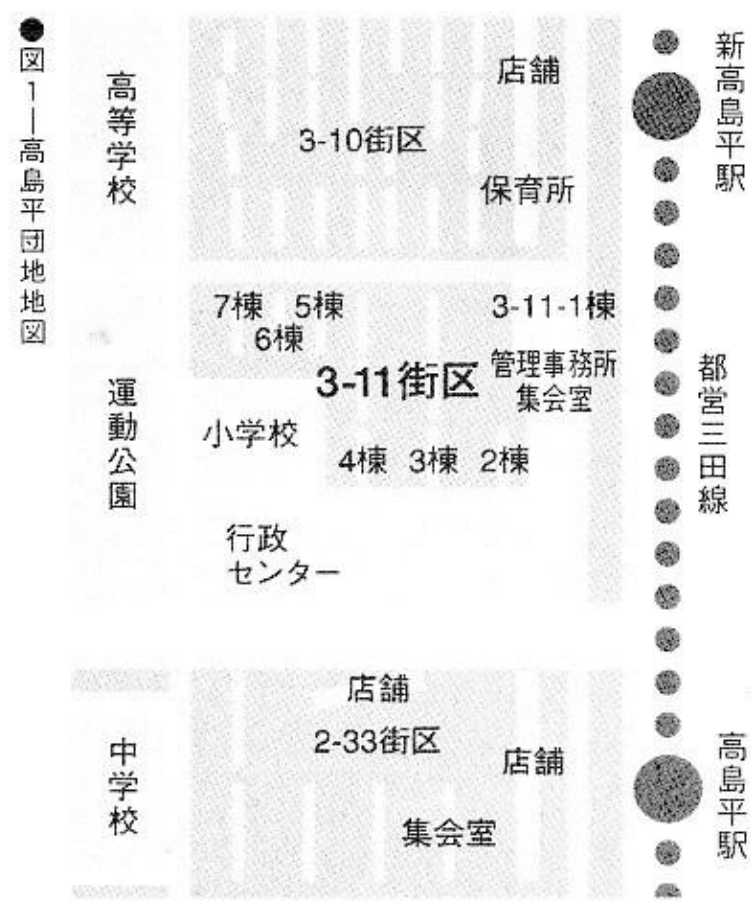
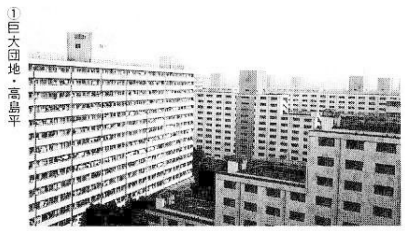

# Map 2: The Takashimadaira housing complex

What does the Takashimadaira housing complex[^takashimadaira] look like now? In fact, in response to the trend of people jumping off buildings around 1980, all 37 high-rise buildings with more than 11 floors were equipped with exterior corridors and exterior stairs starting from the third floor. A fence was put up to prevent people from jumping off the building, and locks were installed on the windows. The stairs to the roof are equipped with locked iron gates. Now it can be said that it is completely impossible to jump off the building. The management has installed with complete suicide prevention devices. Now it looks like an iron prison.

[^takashimadaira]:
    > Tokyo -- They jumped from the roofs of 14-story buildings to their deaths on the pavement below, so the apartment complex locked the doors to the roofs. Others committed suicide by jumping from open passageways and corridor windows, so those were closed off. But Japanese bent on death still come to the 40,000-resident Takashimadaira complex, a group of 64 apartment buildings five- to 14-stories high within Tokyo's city limits. They come from miles away, sometimes riding a train for hours. This year there has been a suicide once every 10 days through September, earning the complex the unwanted nickname of 'Mecca for Suicides.'
    > 
    > UPI ARCHIVES, OCT. 29, 1980, *Apartment complex fights image as 'Mecca for Suicides'*, by John Needham

## History

The housing complex was completed in 1973. It was hailed as the largest complex in Japan at the time, and it still looks grand today. Five incidents of jumping from buildings occurred that year, but what made the complex famous was the 1977 incident in which a mother and her son committed suicide by jumping from a building. For this reason, the complex was known as the "Mecca of Suicide". More than ten people committed suicide every year. In 1980, the number of suicides exceeded 20. By 1982, the total number of suicides reached 100. More than 80% of the suicides are "expedition suicides" from Shizuoka, Niigata and other places, namely people traveling for long distances for the specific purpose of dying there. Some people specifically have bought ladders in order to climb over the fence outside the house. During the peak suicide season, there is a suicide every three days.

To this end, 700 million yen was spent in 1981 to install steel fences and install "life-saving telephones" in the complex, which was a lot of trouble. Despite this, there are still 19- and 18-year-old men and women who smashed glass windows with benches, climbed to the eaves and jumped to their deaths. Perhaps this pair prompted a larger response, though.

A related official said: "In the past seven years (since the establishment of the Takashimadaira Police Station), one incident has only occurred every two or three years. Because of the fence, it is almost impossible to hear anyone committing suicide."

## How to jump off a building

Nowadays, no one will go to Takashimadaira  housing complex to jump anymore, but for those who can't find a suitable place nearby, or "I'm old school. I'm still going for Takashimadaira !", I am here to whisper to you some of the nice places at Taka.

It seems that the complex where people jumped from buildings has been completely blocked, but for some reason Block 3-11 (see map) is completely defenseless. Especially in Building 1 of 3-11, outsiders can enter and exit the outer corridors from the first to the fourteenth floors at will. There is only a one-meter-high low grille. The unprepared situation may even scare the residents. In Buildings 2 to 6 of 3-11, the windows on the corner platform of the stairs do not have locking devices. As long as you climb up the low wall about 150 centimeters, you can jump off smoothly. Even so, I still recommend the 14th-floor exterior corridor of Building 1 of 3-11, where you can see the view of the Itabashi area across from the Toei Line. Needless to say, there is a concrete floor below, and there are few pedestrians. If you fall, you will definitely die. Moreover, there are no railings on the outer stairs of this building.

## Transportation

Take the Toei Mita Line and get off at New Takashimadaira Station, head towards 3-chōme or 4-chōme and turn left. Building No. 1 of 3-11 is adjacent to the train track. It is the only building in the entire community that does not have iron gates installed. You can find it at once.

If you want to see the unique scenery of the iron gate, you might as well get off at Takashimadaira Station, which is one stop ahead for the best vantage point.
