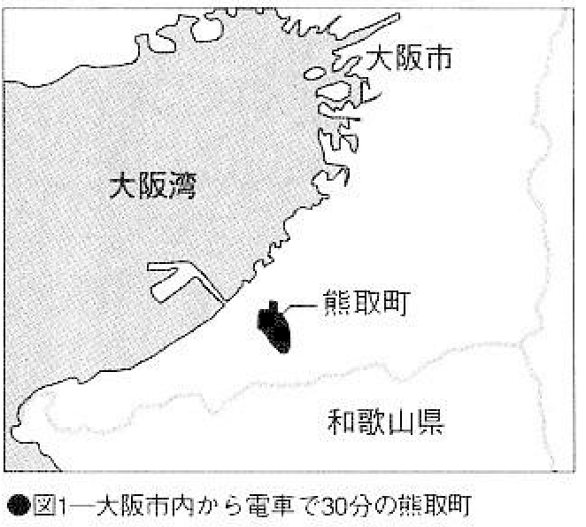
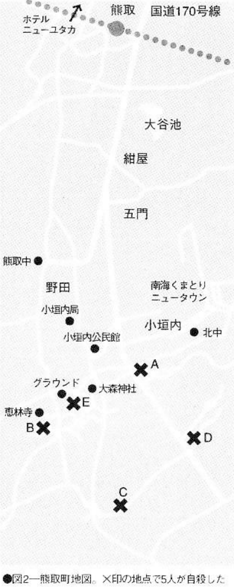

# Suicide Map 4 Kumatori Town serial suicide case

Between June and July 1992, a total of five men and women committed suicide every week in Kumatori Town, Osaka. The first to die was the unemployed boy A (17 years old). It was discovered on June 4th (Thursday). Then on the 10th (Wednesday) Mr. B (18 years old) from the construction industry, on the 17th (Wednesday) the hotel clerk Mr. C (18 years old), and on the 25th (Thursday) Mr. D (22 years old), a civil servant from the neighboring city, hanged himself. suicide. On July 2 (Thursday), E, ​​a female student at Machuchi Sports University, stabbed herself three times in the chest and committed suicide.

Somehow, all of them died on Wednesday or Thursday. The places of suicide are also extremely close, concentrated within a radius of 500 meters. In addition, the first three people were all members of a group of delinquents who formed a Bōsōzoku (Japanese biker gang) a year ago. The motive for all members' suicides is completely unknown. This series of suicides with unknown motives shocked the whole of Japan. Its level of mystery is comparable to the "Death Guide" incident on Mount Mihara in the history of suicide in Japan.

In the local area, most people believe it was serial homicide. If it is so, it means that there is a murderer who kills one person every week and kills five people in total. When this kind of weird suicide occurs, it will inevitably lead to the theory of homicide. However, it’s best not to believe too much.

## Place of death

The population is said to be less than 40,000, but Kumatori is not a rural town. There is a large bus station building in front of the station, and the commercial street is frequently visited by pedestrians. However, if you take a taxi from the station at the west end of the town and drive east along National Route 170 for ten minutes, you will see the existing rural land on the right. Around here, five people committed suicide. Get out and walk around here. There are woods and farm huts everywhere. The place of suicide is your choice.

Check the place of death of the serial suicide beforehand. It may be a good idea to remember the old friend and think of dying serially. The onion hut and small warehouse where Mr. A and Mr. B committed suicide have been demolished. The chestnut tree where Mr. D hanged himself has also been cut down. Only the farm work hut where Mr. C hanged himself is still there. Summer is also a bit spooky, and a hut with a few beams on the roof is the best place to commit suicide. The location of the suicide scene is shown in Figure 2.

## Suicide method

If you want to commit suicide in this town, there is no other option but to hang yourself. When hanging, it is better to use a rope to suit the surrounding atmosphere. It is also interesting to tie yourself behind your back and hang yourself, then lower the rope from a high place to imitate the mystery of serial suicides.[^kumatori-tie-behind] Perhaps the theory of homicide would rise again in the local area, and maybe you have become a prominent figure in the public media. It is best to not leave a suicide note, to enhance the mystery.

[^kumatori-tie-behind]: The fifth death in the series was Mr. T, a member of the Bosozoku, and friend of Mr. K (the fourth death). He asked for leave from the company saying that he "had to attend a friend's funeral" and was granted two days of leave. However, although he rushed back to Kumatori two days after K's death, he was unable to make it to the funeral. Then, he died at a friend's home. His hands were tied behind his back with plastic knots, and he died of hanging. Nearby residents did not hear any suspicious noises. There were no signs of a fight at the scene. Judging from the knotted rope, it could have been done by the deceased himself after hanging, so the police classified the case as suicide.

## Transportation and accommodation

From Osaka, take the JR Loop Line to East Tennoji station, then transfer to the Hanwa Line, which will take you to Kumatoricho Station in 30 minutes.

There are no accommodation facilities in Kumatori Town. If you arrive at night, or plan to rest for a night before committing suicide, you can go to HOTEL NEWyutaka in Izumisano City, which is only five minutes away from the station. This is a recently built high-end hotel with a nice interior decoration. Single rooms are 6,800 yen and double rooms are 14,000 yen, which are reasonable prices.

If you arrive in Kumatori Town rashly, you will be confused about the geographical environment. It is best to arrive the day before, check the environment in advance, stay in this hotel, carefully plan the method and decide the location, and then commit suicide the next day.
